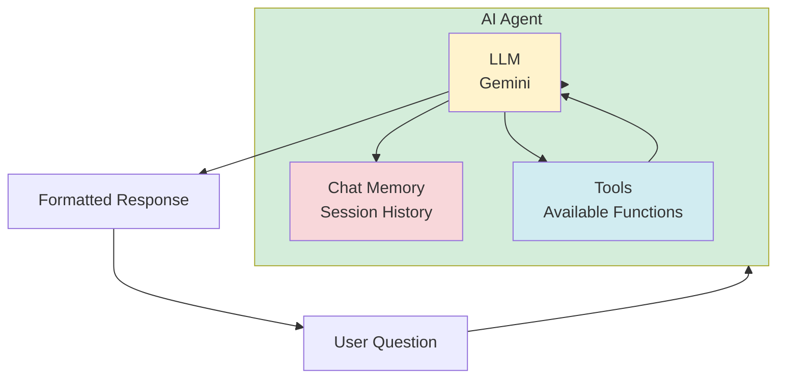
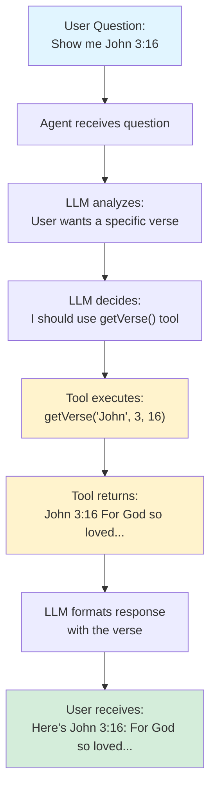
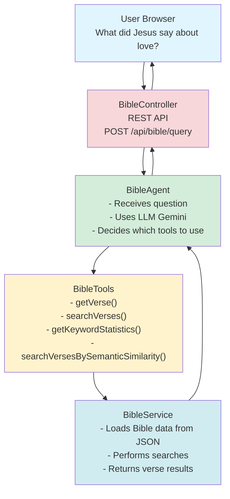
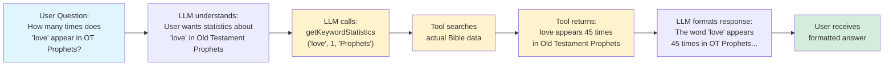

# Chapter 1: Introduction to Agentic AI

## What is Agentic AI?

**Agentic AI** (also called AI Agents) is a type of artificial intelligence that can:
- Understand natural language questions
- Decide which tools to use
- Execute actions using those tools
- Provide intelligent responses based on real data

Think of it as giving an AI assistant **superpowers** - instead of just chatting, it can actually **do things** like search databases, call APIs, perform calculations, and more.

### Traditional Chatbot vs. Agentic AI

**Traditional Chatbot:**
```
User: "What's the weather in Seoul?"
Bot: "I don't have access to weather data. Please check a weather website."
```

**Agentic AI:**
```
User: "What's the weather in Seoul?"
Agent: [Calls weather API tool] → Gets real data → "It's 15°C and sunny in Seoul today."
```

The key difference: **Agentic AI can use tools to access real-time, accurate information**.

## Key Concepts

### 1. LLM (Large Language Model)

An **LLM** is the "brain" of your agent. It's a pre-trained AI model that understands and generates human-like text.

**Examples:**
- Google Gemini
- OpenAI GPT-4
- Anthropic Claude
- Local models (Ollama, Mistral)

**In Bible-AI:**
- We use **Google Gemini 2.5 Flash**
- It processes user questions and generates responses
- It decides which tools to call

### 2. Tools

**Tools** are functions your agent can call to perform actions or retrieve data.

**Think of tools as:**
- A calculator (for math operations)
- A database query function (for data retrieval)
- An API client (for external services)
- A search function (for finding information)

**In Bible-AI, we have tools like:**
- `getVerse()` - Get a specific Bible verse
- `searchVerses()` - Search for verses containing a keyword
- `getKeywordStatistics()` - Analyze word frequency

**Example:**
```java
@Tool("Get a specific Bible verse")
public String getVerse(String bookName, int chapter, int verse) {
    // Returns actual verse text from the Bible
}
```

### 3. RAG (Retrieval-Augmented Generation)

**RAG** helps the AI find relevant information from a large dataset before answering.

**How it works:**
1. Your data is converted into **embeddings** (vector representations)
2. When user asks a question, similar data is retrieved
3. The AI uses this context to give accurate answers

**In Bible-AI:**
- We have ~117,000 Bible verses (Korean + English)
- Each verse is embedded and stored
- When you ask "What did Jesus say about love?", RAG finds relevant verses
- The AI uses those verses to answer accurately

**Note:** In Bible-AI, we use **Reverse RAG** - embedding search is available as a tool, not automatic. This gives better control.

### 4. Agent

An **Agent** is the orchestrator that:
- Receives user questions
- Decides which tools to use
- Calls those tools
- Combines results
- Generates a natural language response



**In Bible-AI:**
```java
BibleAssistant assistant = AiServices.builder(BibleAssistant.class)
    .chatModel(chatModel)           // The LLM brain
    .tools(bibleTools)              // Available tools
    .chatMemory(sessionMemory)      // Conversation history
    .build();
```

## How Agentic AI Works: The Flow

Let's trace what happens when a user asks: **"Show me John 3:16"**



## Why Use Agentic AI?

### Advantages Over Simple Chat

1. **Access to Real Data**
   - Not limited to training data
   - Can query databases, APIs, files
   - Always up-to-date information

2. **Accuracy**
   - Gets exact data, not approximations
   - Can verify information
   - Provides references

3. **Capabilities**
   - Can perform calculations
   - Can search large datasets
   - Can analyze statistics
   - Can execute complex workflows

4. **Domain-Specific**
   - Tailored to your use case
   - Uses your data
   - Understands your domain

## Bible-AI Project Overview

Bible-AI is a practical example of an Agentic AI application. Let's see what it does:

### What Bible-AI Does

**User asks:** "What did Jesus say about love?"

**Bible-AI:**
1. Understands the question
2. Uses `searchVerses("love")` tool in Gospels
3. Gets actual Bible verses
4. Formats response with verse references
5. Provides context and explanation

### Key Components



### What Makes It "Agentic"?

1. **Tool Selection**: The AI decides which tool to use based on the question
2. **Data Access**: Tools access real Bible data (not just training data)
3. **Multi-step Reasoning**: Can combine multiple tools for complex queries
4. **Context Awareness**: Maintains conversation history across multiple questions

## Real-World Example

Let's see a real interaction:

**User:** "How many times does the word 'love' appear in Old Testament Prophets?"

**Bible-AI Process:**



**This is impossible with a simple chatbot** - it requires:
- Access to actual Bible data
- Ability to search and count
- Understanding of Bible structure (Old Testament, Prophets)
- Tool execution capability

## Common Use Cases for Agentic AI

1. **Customer Support Agents**
   - Access order databases
   - Check account status
   - Process refunds

2. **Data Analysis Agents**
   - Query databases
   - Generate reports
   - Perform calculations

3. **Content Retrieval Agents** (like Bible-AI)
   - Search large document collections
   - Provide accurate citations
   - Answer domain-specific questions

4. **Workflow Automation Agents**
   - Execute multi-step processes
   - Integrate with multiple systems
   - Make decisions based on data

## What You'll Learn

By the end of this guide, you'll be able to:

✅ Build your own Agentic AI application  
✅ Create custom tools for your domain  
✅ Set up RAG for semantic search  
✅ Manage sessions and conversations  
✅ Deploy to production  

## Next Steps

Now that you understand what Agentic AI is, let's get started:

1. **Chapter 2**: Set up your development environment
2. **Chapter 3**: Learn LangChain4j basics
3. **Chapter 4**: Configure your first LLM
4. **Chapter 5**: Build your first tool

Ready? Let's build something amazing! 🚀

## Key Takeaways

- **Agentic AI** = AI that can use tools to access real data
- **LLM** = The brain that understands and generates text
- **Tools** = Functions the agent can call to do things
- **RAG** = Method to find relevant information from large datasets
- **Agent** = The orchestrator that combines everything

**Remember:** Agentic AI is about giving AI the ability to **act**, not just **talk**.

---

## Navigation

| [← Previous](home) | [Home](home) | [Next →](02-project-setup) |
|:---|:---:|---:|
| Table of Contents | Building Agentic AI Applications with Java | Chapter 2: Project Setup |

