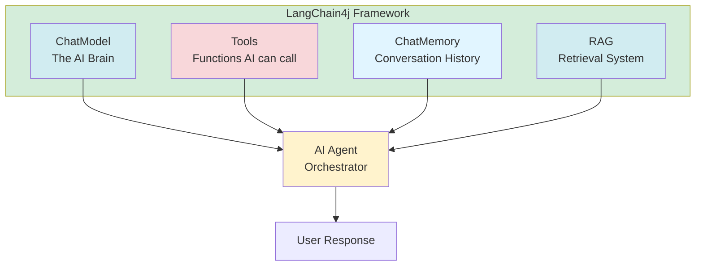
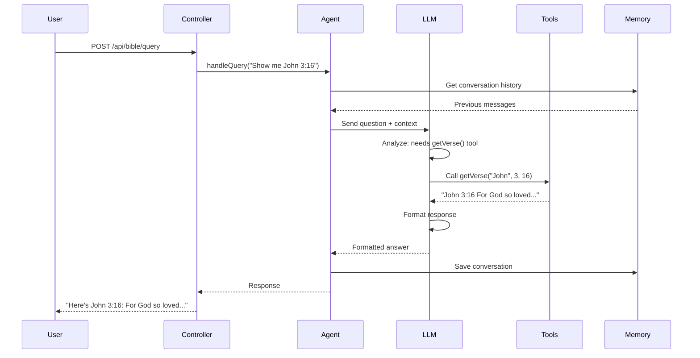
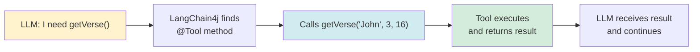

# Chapter 3: Understanding LangChain4j

LangChain4j is the Java framework that makes building Agentic AI applications possible. In this chapter, we'll explore its core concepts and how they work together.

## What is LangChain4j?

**LangChain4j** is a Java framework for building applications with Large Language Models (LLMs). It provides:

- **Abstraction layer** for different LLM providers (Gemini, OpenAI, Ollama, etc.)
- **Tool integration** - easy way to give AI access to functions
- **Memory management** - conversation history handling
- **RAG support** - retrieval-augmented generation
- **Agent orchestration** - putting it all together

Think of it as the **glue** that connects your LLM, tools, and data.

## Core Components

LangChain4j has four main components:



### 1. ChatModel

**ChatModel** is the interface to your LLM (Large Language Model). It's the "brain" that:
- Understands user questions
- Generates responses
- Decides which tools to use

**Example:**
```java
ChatModel chatModel = GoogleAiGeminiChatModel.builder()
    .modelName("gemini-2.5-flash-lite")
    .apiKey(apiKey)
    .build();
```

**Key Point:** ChatModel is **provider-agnostic**. You can switch from Gemini to OpenAI without changing your agent code.

### 2. Tools

**Tools** are functions your agent can call. They're regular Java methods annotated with `@Tool`.

**Example:**
```java
@Component
public class BibleTools {
    
    @Tool("Get a specific Bible verse")
    public String getVerse(String bookName, int chapter, int verse) {
        // Your implementation
        return "John 3:16 For God so loved the world...";
    }
}
```

**Key Point:** Tools are **just Java methods**. No special syntax needed - just add `@Tool` annotation.

### 3. ChatMemory

**ChatMemory** stores conversation history so the agent remembers previous messages.

**Example:**
```java
ChatMemory memory = MessageWindowChatMemory.withMaxMessages(10);
```

**Key Point:** Memory is **session-based**. Each user gets their own memory.

### 4. RAG (Retrieval-Augmented Generation)

**RAG** helps the AI find relevant information from your data before answering.

**Key Point:** In Bible-AI, we use **Reverse RAG** - embedding search is a tool, not automatic.

## How It Works: Request Flow

Let's trace a complete request through LangChain4j:



## Building an Agent with AiServices

The `AiServices` builder is the main way to create an AI agent in LangChain4j.

### Basic Structure

```java
public interface BibleAssistant {
    String chat(@UserMessage String userMessage);
}

BibleAssistant assistant = AiServices.builder(BibleAssistant.class)
    .chatModel(chatModel)           // Required: The LLM
    .tools(bibleTools)              // Optional: Available tools
    .chatMemory(sessionMemory)     // Optional: Conversation history
    .contentRetriever(ragRetriever) // Optional: RAG system
    .systemMessageProvider(chatId -> systemPrompt) // Optional: Instructions
    .build();
```

### Step-by-Step Breakdown

#### Step 1: Define the Interface

```java
public interface BibleAssistant {
    String chat(@UserMessage String userMessage);
}
```

- This is a **functional interface** - just one method
- `@UserMessage` annotation marks the user's input
- Return type is `String` (the AI's response)

#### Step 2: Build the Agent

```java
BibleAssistant assistant = AiServices.builder(BibleAssistant.class)
    // ... configuration
    .build();
```

- `AiServices.builder()` creates a proxy for your interface
- LangChain4j implements the interface methods
- You get a working AI agent!

#### Step 3: Configure Components

```java
.chatModel(chatModel)           // The LLM brain
.tools(bibleTools)              // Functions to call
.chatMemory(sessionMemory)      // Remember conversations
.contentRetriever(ragRetriever) // Find relevant data
.systemMessageProvider(...)     // Instructions for AI
```

### Real Example from Bible-AI

```java
@Service
@RequiredArgsConstructor
public class BibleAgent {
    private final ChatModel chatModel;
    private final BibleTools bibleTools;
    private final SessionMemoryManager sessionMemoryManager;
    
    public String handleQuery(String userQuery, String sessionId) {
        ChatMemory sessionMemory = sessionMemoryManager.getOrCreateMemory(sessionId);
        
        String systemMessage = """
            You are a Bible study assistant.
            Always provide accurate verse references.
            Use tools to get actual Bible data.
            """;
        
        BibleAssistant assistant = AiServices.builder(BibleAssistant.class)
            .chatModel(chatModel)
            .chatMemory(sessionMemory)
            .tools(bibleTools)
            .systemMessageProvider(chatId -> systemMessage)
            .build();
        
        return assistant.chat(userQuery);
    }
}
```

## Understanding the Flow

### 1. User Sends Question

```java
String response = assistant.chat("Show me John 3:16");
```

### 2. LangChain4j Processes

1. **Receives** the user message
2. **Loads** conversation history from memory
3. **Sends** to LLM with context
4. **LLM decides** which tools to use (if any)
5. **Executes** tools and gets results
6. **LLM formats** final response
7. **Saves** conversation to memory
8. **Returns** response to user

### 3. Tool Execution

When LLM decides to use a tool:



## Key Concepts

### 1. System Messages

**System messages** are instructions for the AI. They tell it:
- What its role is
- How to behave
- When to use tools
- How to format responses

**Example:**
```java
String systemMessage = """
    You are a Bible study assistant.
    Always provide accurate verse references.
    Use getVerse() tool for specific verses.
    Use searchVerses() for keyword searches.
    """;
```

### 2. Tool Descriptions

The `@Tool` annotation description is **critical**. The LLM reads this to decide when to use the tool.

**Good description:**
```java
@Tool("Get a specific Bible verse by book name, chapter, and verse number. " +
      "Returns the verse text with reference (e.g., 'John 3:16').")
public String getVerse(String bookName, int chapter, int verse) {
    // ...
}
```

**Bad description:**
```java
@Tool("Get verse")  // Too vague!
public String getVerse(String bookName, int chapter, int verse) {
    // ...
}
```

### 3. Memory Management

**ChatMemory** stores the conversation. Common types:

- `MessageWindowChatMemory`: Keeps last N messages
- `TokenWindowChatMemory`: Keeps messages within token limit

**Example:**
```java
ChatMemory memory = MessageWindowChatMemory.withMaxMessages(10);
// Keeps last 10 messages
```

### 4. Error Handling

LangChain4j can throw exceptions. Always wrap in try-catch:

```java
try {
    return assistant.chat(userQuery);
} catch (Exception e) {
    log.error("Failed to process query", e);
    return "Sorry, I encountered an error. Please try again.";
}
```

## Common Patterns

### Pattern 1: Simple Agent (No Tools)

```java
BibleAssistant assistant = AiServices.builder(BibleAssistant.class)
    .chatModel(chatModel)
    .build();
```

Use when: You just want a chatbot, no special functions.

### Pattern 2: Agent with Tools

```java
BibleAssistant assistant = AiServices.builder(BibleAssistant.class)
    .chatModel(chatModel)
    .tools(bibleTools)
    .build();
```

Use when: AI needs to access data or perform actions.

### Pattern 3: Agent with Memory

```java
BibleAssistant assistant = AiServices.builder(BibleAssistant.class)
    .chatModel(chatModel)
    .tools(bibleTools)
    .chatMemory(sessionMemory)
    .build();
```

Use when: You want multi-turn conversations.

### Pattern 4: Full-Featured Agent

```java
BibleAssistant assistant = AiServices.builder(BibleAssistant.class)
    .chatModel(chatModel)
    .tools(bibleTools)
    .chatMemory(sessionMemory)
    .contentRetriever(ragRetriever)
    .systemMessageProvider(chatId -> systemMessage)
    .build();
```

Use when: You need everything - tools, memory, RAG, and custom instructions.

## Best Practices

### 1. Keep System Messages Clear

✅ **Good:**
```
You are a Bible study assistant. 
Always provide verse references.
Use tools to get actual data.
```

❌ **Bad:**
```
You are helpful. Be nice. Do stuff.
```

### 2. Describe Tools Well

✅ **Good:**
```
Get a specific Bible verse by book name, chapter, and verse number.
Returns the verse text with reference.
```

❌ **Bad:**
```
Gets verse.
```

### 3. Manage Memory Size

✅ **Good:**
```java
MessageWindowChatMemory.withMaxMessages(10)  // Reasonable limit
```

❌ **Bad:**
```java
MessageWindowChatMemory.withMaxMessages(1000)  // Too large, may cause issues
```

### 4. Handle Errors Gracefully

✅ **Good:**
```java
try {
    return assistant.chat(query);
} catch (Exception e) {
    log.error("Error", e);
    return "I encountered an error. Please try again.";
}
```

❌ **Bad:**
```java
return assistant.chat(query);  // No error handling!
```

## Common Mistakes

### Mistake 1: Forgetting @Tool Annotation

```java
// ❌ Wrong - no @Tool annotation
public String getVerse(String bookName, int chapter, int verse) {
    // ...
}

// ✅ Correct
@Tool("Get a specific Bible verse")
public String getVerse(String bookName, int chapter, int verse) {
    // ...
}
```

### Mistake 2: Vague Tool Descriptions

```java
// ❌ Wrong - too vague
@Tool("Get verse")

// ✅ Correct - descriptive
@Tool("Get a specific Bible verse by book name, chapter, and verse number")
```

### Mistake 3: Not Managing Memory

```java
// ❌ Wrong - memory grows forever
ChatMemory memory = MessageWindowChatMemory.withMaxMessages(Integer.MAX_VALUE);

// ✅ Correct - reasonable limit
ChatMemory memory = MessageWindowChatMemory.withMaxMessages(10);
```

## Quick Reference

### Essential Imports

```java
import dev.langchain4j.model.chat.ChatModel;
import dev.langchain4j.memory.ChatMemory;
import dev.langchain4j.memory.chat.MessageWindowChatMemory;
import dev.langchain4j.service.AiServices;
import dev.langchain4j.service.UserMessage;
import dev.langchain4j.agent.tool.Tool;
```

### Basic Agent Setup

```java
// 1. Define interface
public interface MyAssistant {
    String chat(@UserMessage String message);
}

// 2. Build agent
MyAssistant assistant = AiServices.builder(MyAssistant.class)
    .chatModel(chatModel)
    .tools(myTools)
    .chatMemory(memory)
    .build();

// 3. Use it
String response = assistant.chat("Hello!");
```

### Tool Definition

```java
@Component
public class MyTools {
    @Tool("Description of what this tool does")
    public String myTool(String param) {
        // Implementation
        return "result";
    }
}
```

## Next Steps

Now that you understand LangChain4j basics:

1. **Chapter 4**: Configure your LLM (Gemini, OpenAI, etc.)
2. **Chapter 5**: Build your first tool
3. **Chapter 10**: Create your first agent

## Key Takeaways

✅ **LangChain4j** = Framework for building AI agents in Java  
✅ **ChatModel** = Interface to LLM (the brain)  
✅ **Tools** = Functions AI can call (annotated with @Tool)  
✅ **ChatMemory** = Conversation history storage  
✅ **AiServices.builder()** = Main way to create agents  
✅ **System messages** = Instructions for AI behavior  
✅ **Tool descriptions** = Critical for AI to know when to use tools  

**Remember:** LangChain4j is just Java code. No magic - just well-designed abstractions!

---

## Navigation

| [← Previous](02-project-setup) | [Home](home) | [Next →](04-llm-configuration) |
|:---|:---:|---:|
| Chapter 2: Project Setup | Building Agentic AI Applications with Java | Chapter 4: LLM Configuration |

