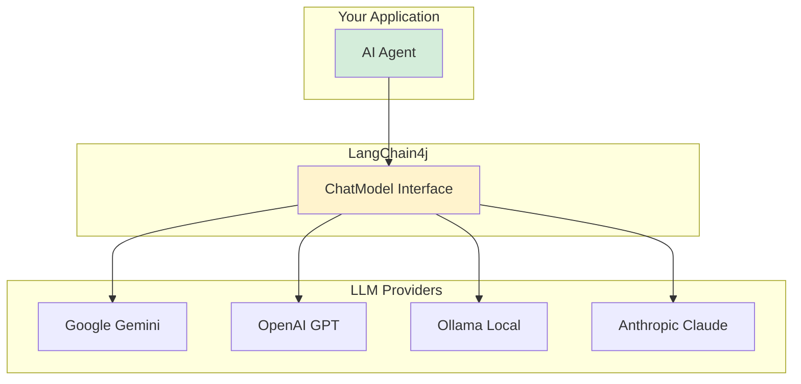

# Chapter 4: LLM Configuration

The Large Language Model (LLM) is the "brain" of your agent. In this chapter, we'll learn how to configure different LLM providers and understand the options available.

## What is a ChatModel?

**ChatModel** is LangChain4j's interface to any LLM provider. It abstracts away the differences between providers, so you can switch from Gemini to OpenAI without changing your agent code.



## Setting Up Google Gemini

Gemini is Google's LLM. It's a good choice for most applications.

### Step 1: Get API Key

1. Go to [Google AI Studio](https://makersuite.google.com/app/apikey)
2. Sign in with your Google account
3. Click "Create API Key"
4. Copy the key

### Step 2: Add Dependency

In `pom.xml`:

```xml
<dependency>
    <groupId>dev.langchain4j</groupId>
    <artifactId>langchain4j-google-ai-gemini</artifactId>
    <version>1.2.0</version>
</dependency>
```

### Step 3: Create Configuration Class

```java
package io.github.nicechester.bibleai.config;

import dev.langchain4j.model.googleai.GoogleAiGeminiChatModel;
import lombok.extern.log4j.Log4j2;
import org.springframework.beans.factory.annotation.Value;
import org.springframework.context.annotation.Bean;
import org.springframework.context.annotation.Configuration;

@Log4j2
@Configuration
public class LLMConfig {
    
    @Value("${langchain4j.llm.gemini.api-key}")
    private String apiKey;
    
    @Value("${langchain4j.llm.gemini.model-name:gemini-2.5-flash-lite}")
    private String modelName;
    
    @Bean
    public GoogleAiGeminiChatModel chatModel() {
        log.info("Configuring Gemini ChatModel with model: {}", modelName);
        return GoogleAiGeminiChatModel.builder()
                .modelName(modelName)
                .apiKey(apiKey)
                .maxRetries(0)
                .build();
    }
}
```

### Step 4: Configure in application.yml

```yaml
langchain4j:
  llm:
    gemini:
      model-name: ${GEMINI_MODEL_NAME:gemini-2.5-flash-lite}
      api-key: ${GEMINI_API_KEY:}
```

### Step 5: Set Environment Variable

```bash
export GEMINI_API_KEY=your-api-key-here
```

### Available Gemini Models

- `gemini-2.5-flash-lite` - Fast, cost-effective (default)
- `gemini-2.5-flash` - Balanced speed and capability
- `gemini-2.5-pro` - Most capable, slower
- `gemini-1.5-pro` - Previous generation, still powerful

### Configuration Options

```java
GoogleAiGeminiChatModel.builder()
    .modelName("gemini-2.5-flash-lite")
    .apiKey(apiKey)
    .maxRetries(3)                    // Retry failed requests
    .temperature(0.7)                 // Creativity (0.0-1.0)
    .topP(0.9)                        // Nucleus sampling
    .topK(40)                         // Top-k sampling
    .maxTokens(2048)                  // Max response length
    .build();
```

## Setting Up OpenAI

OpenAI provides GPT-4, GPT-3.5, and other models.

### Step 1: Get API Key

1. Go to [OpenAI Platform](https://platform.openai.com/api-keys)
2. Sign in or create account
3. Create new API key
4. Copy the key (save it - you can't see it again!)

### Step 2: Add Dependency

```xml
<dependency>
    <groupId>dev.langchain4j</groupId>
    <artifactId>langchain4j-open-ai</artifactId>
    <version>1.2.0</version>
</dependency>
```

### Step 3: Configuration

```java
import dev.langchain4j.model.openai.OpenAiChatModel;

@Bean
public OpenAiChatModel chatModel() {
    return OpenAiChatModel.builder()
            .apiKey(apiKey)
            .modelName("gpt-4o-mini")  // or "gpt-4", "gpt-3.5-turbo"
            .temperature(0.7)
            .maxTokens(1000)
            .build();
}
```

### Step 4: application.yml

```yaml
langchain4j:
  llm:
    open-ai:
      api-key: ${OPENAI_API_KEY:}
      model-name: ${OPENAI_MODEL_NAME:gpt-4o-mini}
```

## Setting Up Ollama (Local)

Ollama lets you run LLMs locally - no API keys needed!

### Step 1: Install Ollama

```bash
# macOS
brew install ollama

# Linux
curl -fsSL https://ollama.com/install.sh | sh
```

### Step 2: Start Ollama and Pull Model

```bash
ollama serve
ollama pull mistral:7b  # or llama2, codellama, etc.
```

### Step 3: Add Dependency

```xml
<dependency>
    <groupId>dev.langchain4j</groupId>
    <artifactId>langchain4j-ollama</artifactId>
    <version>1.2.0</version>
</dependency>
```

### Step 4: Configuration

```java
import dev.langchain4j.model.ollama.OllamaChatModel;

@Bean
public OllamaChatModel chatModel() {
    return OllamaChatModel.builder()
            .baseUrl("http://localhost:11434")
            .modelName("mistral:7b")
            .temperature(0.7)
            .build();
}
```

### Step 5: application.yml

```yaml
langchain4j:
  llm:
    ollama:
      base-url: ${OLLAMA_BASE_URL:http://localhost:11434}
      model-name: ${OLLAMA_MODEL_NAME:mistral:7b}
```

## Using ChatModel Interface

Once configured, use the `ChatModel` interface (not the specific implementation):

```java
@Service
@RequiredArgsConstructor
public class BibleAgent {
    private final ChatModel chatModel;  // Interface, not GoogleAiGeminiChatModel
    
    public String handleQuery(String query) {
        BibleAssistant assistant = AiServices.builder(BibleAssistant.class)
            .chatModel(chatModel)  // Works with any provider!
            .build();
        return assistant.chat(query);
    }
}
```

**Key Benefit:** You can switch providers by changing the `@Bean` method - no code changes needed!

## Model Selection Guide

### For Development/Testing
- **Ollama (local)**: Free, no API costs, good for testing
- **Gemini Flash Lite**: Fast, cheap, good for development

### For Production
- **Gemini Flash**: Good balance of speed and quality
- **GPT-4o Mini**: OpenAI's cost-effective option
- **Gemini Pro**: Best quality, higher cost

### For Specialized Tasks
- **GPT-4**: Best for complex reasoning
- **Claude**: Good for long context windows
- **Local models**: For privacy-sensitive applications

## Configuration Parameters

### Temperature

Controls randomness/creativity:

```java
.temperature(0.0)  // Deterministic, always same answer
.temperature(0.7)  // Balanced (recommended)
.temperature(1.0)  // Very creative, unpredictable
```

**Use lower (0.0-0.3) for:**
- Factual queries
- Data retrieval
- Consistent responses

**Use higher (0.7-1.0) for:**
- Creative writing
- Brainstorming
- Varied responses

### Max Tokens

Limits response length:

```java
.maxTokens(100)   // Short responses
.maxTokens(1000)  // Medium (default)
.maxTokens(4000) // Long responses
```

**Consider:**
- Shorter = faster, cheaper
- Longer = more detailed but slower

### Top-P and Top-K

Advanced sampling parameters:

```java
.topP(0.9)   // Nucleus sampling (0.0-1.0)
.topK(40)    // Top-k sampling (1-100)
```

Usually defaults are fine. Adjust only if you need specific behavior.

## Error Handling

### API Key Errors

```java
try {
    return chatModel.generate("Hello");
} catch (dev.langchain4j.exception.InvalidApiKeyException e) {
    log.error("Invalid API key", e);
    // Handle: check environment variable, key format, etc.
}
```

### Rate Limiting

```java
GoogleAiGeminiChatModel.builder()
    .apiKey(apiKey)
    .maxRetries(3)  // Retry on rate limit
    .build();
```

### Network Errors

```java
try {
    return chatModel.generate(query);
} catch (dev.langchain4j.exception.HttpException e) {
    log.error("Network error", e);
    // Handle: retry, fallback, etc.
}
```

## Best Practices

### 1. Use Environment Variables

✅ **Good:**
```yaml
api-key: ${GEMINI_API_KEY:}
```

❌ **Bad:**
```yaml
api-key: AIzaSyAbc123...  # Never commit API keys!
```

### 2. Use ChatModel Interface

✅ **Good:**
```java
private final ChatModel chatModel;  // Interface
```

❌ **Bad:**
```java
private final GoogleAiGeminiChatModel chatModel;  // Too specific
```

### 3. Configure Retries

✅ **Good:**
```java
.maxRetries(3)  // Handle transient errors
```

❌ **Bad:**
```java
.maxRetries(0)  // Fails on first error
```

### 4. Set Reasonable Limits

✅ **Good:**
```java
.maxTokens(1000)  // Reasonable limit
```

❌ **Bad:**
```java
.maxTokens(100000)  // Too large, expensive
```

## Switching Between Providers

You can easily switch providers by changing the `@Bean`:

```java
// Switch from Gemini to OpenAI
@Bean
public ChatModel chatModel() {
    // return GoogleAiGeminiChatModel.builder()...  // Old
    return OpenAiChatModel.builder()...              // New
}
```

Your agent code doesn't change because it uses the `ChatModel` interface!

## Testing Your Configuration

### Simple Test

```java
@SpringBootTest
class LLMConfigTest {
    
    @Autowired
    private ChatModel chatModel;
    
    @Test
    void testChatModel() {
        String response = chatModel.generate("Say hello");
        assertNotNull(response);
        assertFalse(response.isEmpty());
    }
}
```

### Health Check

Add to `application.yml`:

```yaml
management:
  endpoints:
    web:
      exposure:
        include: health
```

Check: `http://localhost:8080/actuator/health`

## Common Issues

### Issue 1: API Key Not Found

**Error:** `GEMINI_API_KEY environment variable is not set`

**Solution:**
```bash
export GEMINI_API_KEY=your-key-here
```

### Issue 2: Invalid API Key

**Error:** `Invalid API key`

**Solution:**
- Check key is correct
- Verify key hasn't expired
- Check for extra spaces

### Issue 3: Model Not Found

**Error:** `Model gemini-xyz not found`

**Solution:**
- Check model name spelling
- Verify model is available in your region
- Use a supported model name

### Issue 4: Rate Limiting

**Error:** `Rate limit exceeded`

**Solution:**
- Add retries: `.maxRetries(3)`
- Implement exponential backoff
- Consider upgrading API tier

## Quick Reference

### Gemini Setup

```java
@Bean
public ChatModel chatModel() {
    return GoogleAiGeminiChatModel.builder()
        .modelName("gemini-2.5-flash-lite")
        .apiKey(apiKey)
        .maxRetries(3)
        .build();
}
```

### OpenAI Setup

```java
@Bean
public ChatModel chatModel() {
    return OpenAiChatModel.builder()
        .apiKey(apiKey)
        .modelName("gpt-4o-mini")
        .temperature(0.7)
        .build();
}
```

### Ollama Setup

```java
@Bean
public ChatModel chatModel() {
    return OllamaChatModel.builder()
        .baseUrl("http://localhost:11434")
        .modelName("mistral:7b")
        .build();
}
```

## Next Steps

Now that you can configure LLMs:

1. **Chapter 5**: Build your first tool
2. **Chapter 10**: Create your first agent
3. **Chapter 21**: Support multiple LLM providers

## Key Takeaways

✅ **ChatModel** = Interface to any LLM provider  
✅ **Use interface, not implementation** for flexibility  
✅ **Environment variables** for API keys (never commit!)  
✅ **Temperature** controls creativity (0.0-1.0)  
✅ **Max tokens** limits response length  
✅ **Retries** handle transient errors  
✅ **Easy to switch** providers by changing @Bean  

**Remember:** Start with Gemini Flash Lite for development, then optimize for production!

---

## Navigation

| [← Previous](03-langchain4j-basics) | [Home](home) | [Next →](05-building-tools) |
|:---|:---:|---:|
| Chapter 3: Understanding LangChain4j | Building Agentic AI Applications with Java | Chapter 5: Building Tools |

