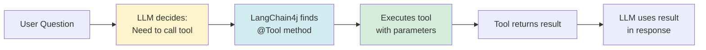
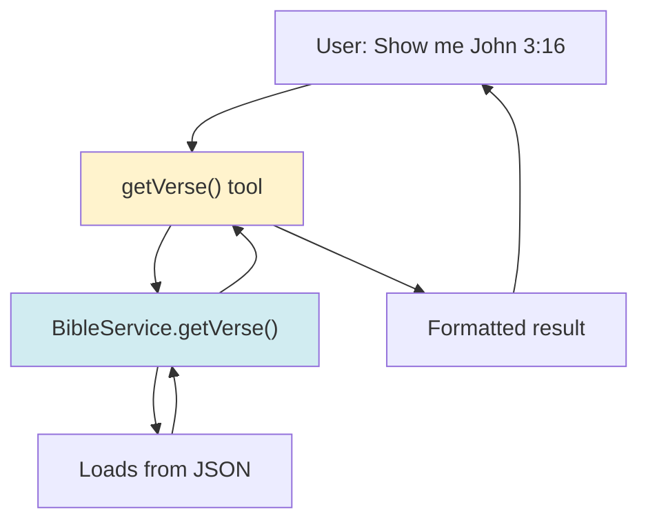
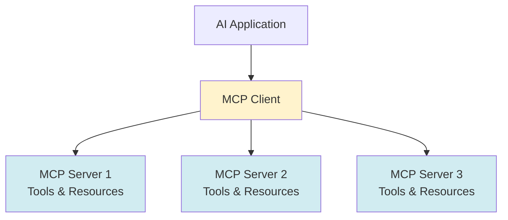

# Chapter 5: Building Tools

Tools are the functions your AI agent can call to perform actions or retrieve data. In this chapter, we'll learn how to create tools and make them available to your agent.

## What are Tools?

**Tools** are regular Java methods that the AI can call. They're annotated with `@Tool` and can:
- Access databases
- Call APIs
- Perform calculations
- Search data
- Execute any Java code



## Your First Tool

Let's create a simple tool that gets a Bible verse.

### Step 1: Create the Tool Class

```java
package io.github.nicechester.bibleai.tool;

import dev.langchain4j.agent.tool.Tool;
import lombok.RequiredArgsConstructor;
import lombok.extern.log4j.Log4j2;
import org.springframework.stereotype.Component;

@Log4j2
@Component
@RequiredArgsConstructor
public class BibleTools {
    
    private final BibleService bibleService;
    
    @Tool("Get a specific Bible verse by book name, chapter, and verse number. " +
          "Returns the verse text with reference (e.g., 'John 3:16').")
    public String getVerse(String bookName, int chapter, int verse) {
        log.info("Getting verse: {} {}:{}", bookName, chapter, verse);
        try {
            VerseResult result = bibleService.getVerse(bookName, chapter, verse);
            if (result == null) {
                return String.format("Verse not found: %s %d:%d", bookName, chapter, verse);
            }
            return formatVerseResult(result);
        } catch (Exception e) {
            log.error("Failed to get verse", e);
            return "Error: " + e.getMessage();
        }
    }
    
    private String formatVerseResult(VerseResult result) {
        StringBuilder sb = new StringBuilder();
        sb.append(result.getReference());
        if (result.getTitle() != null && !result.getTitle().isEmpty()) {
            sb.append(" <").append(result.getTitle()).append(">");
        }
        sb.append("\n").append(result.getText());
        return sb.toString();
    }
}
```

### Step 2: Key Components

1. **@Component**: Makes it a Spring bean
2. **@Tool**: Marks the method as a tool
3. **Tool description**: Critical - LLM reads this to decide when to use it
4. **Method signature**: Parameters become tool parameters
5. **Return type**: Must be String (or primitive types)

### Step 3: Make It Available to Agent

```java
@Service
@RequiredArgsConstructor
public class BibleAgent {
    private final BibleTools bibleTools;  // Inject tools
    
    public String handleQuery(String query) {
        BibleAssistant assistant = AiServices.builder(BibleAssistant.class)
            .chatModel(chatModel)
            .tools(bibleTools)  // Add tools here
            .build();
        return assistant.chat(query);
    }
}
```

## Tool Description Best Practices

The tool description is **critical**. The LLM uses it to decide when to call the tool.

### ✅ Good Description

```java
@Tool("Get a specific Bible verse by book name, chapter, and verse number. " +
      "Returns the verse text with reference (e.g., 'John 3:16'). " +
      "Use this when user asks for a specific verse.")
public String getVerse(String bookName, int chapter, int verse) {
    // ...
}
```

**Why it's good:**
- Explains what it does
- Shows example
- Tells when to use it

### ❌ Bad Description

```java
@Tool("Get verse")  // Too vague!
public String getVerse(String bookName, int chapter, int verse) {
    // ...
}
```

**Why it's bad:**
- LLM doesn't know when to use it
- No context about parameters
- No example

## Tool Parameters

### Simple Types

LangChain4j supports:
- `String`
- `int`, `Integer`
- `long`, `Long`
- `double`, `Double`
- `boolean`, `Boolean`
- `List<String>`, `List<Integer>`, etc.

### Example: Multiple Parameters

```java
@Tool("Get verses in a range. Returns all verses from startVerse to endVerse " +
      "in the specified chapter.")
public String getVerseRange(String bookName, int chapter, 
                           int startVerse, int endVerse) {
    // Implementation
}
```

### Example: Optional Parameters

```java
@Tool("Get statistics about a keyword. Optional filters: testament " +
      "(1=Old Testament, 2=New Testament, null=all) and bookType.")
public String getKeywordStatistics(String keyword, 
                                   Integer testament, 
                                   String bookType) {
    // testament and bookType can be null
    // LLM will pass null if not specified
}
```

## Return Types

### String (Recommended)

```java
@Tool("Get a verse")
public String getVerse(String bookName, int chapter, int verse) {
    return "John 3:16 For God so loved the world...";
}
```

**Best for:** Most tools - flexible, easy to format

### Primitive Types

```java
@Tool("Count verses in a chapter")
public int countVerses(String bookName, int chapter) {
    return 50;
}
```

**Note:** LLM receives the number as a string representation

### Complex Objects (Not Recommended)

```java
// ❌ Avoid - LLM can't easily use complex objects
@Tool("Get verse")
public VerseResult getVerse(String bookName, int chapter, int verse) {
    return new VerseResult(...);
}
```

**Better:**
```java
// ✅ Convert to string
@Tool("Get verse")
public String getVerse(String bookName, int chapter, int verse) {
    VerseResult result = bibleService.getVerse(bookName, chapter, verse);
    return formatVerseResult(result);  // Convert to string
}
```

## Error Handling in Tools

Always handle errors gracefully:

```java
@Tool("Get a verse")
public String getVerse(String bookName, int chapter, int verse) {
    try {
        VerseResult result = bibleService.getVerse(bookName, chapter, verse);
        if (result == null) {
            return String.format("Verse not found: %s %d:%d", 
                               bookName, chapter, verse);
        }
        return formatVerseResult(result);
    } catch (Exception e) {
        log.error("Failed to get verse", e);
        return "Error: " + e.getMessage();
    }
}
```

**Why:**
- Prevents agent from crashing
- Provides useful error messages
- Allows agent to try alternative approaches

## Tool Examples from Bible-AI

### Example 1: Simple Lookup

```java
@Tool("Get a specific Bible verse by book name, chapter, and verse number. " +
      "Returns the verse text with reference (e.g., 'John 3:16').")
public String getVerse(String bookName, int chapter, int verse) {
    VerseResult result = bibleService.getVerse(bookName, chapter, verse);
    if (result == null) {
        return String.format("Verse not found: %s %d:%d", 
                           bookName, chapter, verse);
    }
    return formatVerseResult(result);
}
```

### Example 2: Search Tool

```java
@Tool("Search for Bible verses containing a keyword. " +
      "Returns matching verses with their references. " +
      "Use this when user asks about a specific topic or word.")
public String searchVerses(String keyword) {
    List<VerseResult> results = bibleService.searchVerses(keyword);
    if (results.isEmpty()) {
        return String.format("No verses found containing: %s", keyword);
    }
    // Limit results to avoid overwhelming response
    return results.stream()
        .limit(10)
        .map(this::formatVerseResult)
        .collect(Collectors.joining("\n\n"));
}
```

### Example 3: Statistics Tool

```java
@Tool("Get statistics about a keyword: how many times it appears, " +
      "in which books, and sample references. " +
      "Optional filters: testament (1=Old Testament, 2=New Testament, null=all) " +
      "and bookType (e.g., 'Prophets', 'Gospels', 'Epistles', null=all).")
public String getKeywordStatistics(String keyword, 
                                   Integer testament, 
                                   String bookType) {
    Map<String, Object> stats = bibleService.getKeywordStatistics(
        keyword, testament, bookType);
    
    StringBuilder sb = new StringBuilder();
    sb.append("Keyword: ").append(stats.get("keyword")).append("\n");
    sb.append("Total occurrences: ").append(stats.get("totalOccurrences"));
    // ... format more stats
    
    return sb.toString();
}
```

## Tool Composition

Tools can call other services, which can use other tools indirectly:



## Testing Your Tools

### Unit Test Example

```java
@SpringBootTest
class BibleToolsTest {
    
    @Autowired
    private BibleTools bibleTools;
    
    @Test
    void testGetVerse() {
        String result = bibleTools.getVerse("John", 3, 16);
        assertNotNull(result);
        assertTrue(result.contains("John 3:16"));
        assertTrue(result.contains("For God so loved"));
    }
    
    @Test
    void testGetVerseNotFound() {
        String result = bibleTools.getVerse("NonExistent", 1, 1);
        assertTrue(result.contains("not found"));
    }
}
```

## Common Patterns

### Pattern 1: Lookup Tool

```java
@Tool("Get entity by ID")
public String getEntity(String id) {
    Entity entity = service.findById(id);
    return entity != null ? entity.toString() : "Not found";
}
```

### Pattern 2: Search Tool

```java
@Tool("Search for entities matching keyword")
public String searchEntities(String keyword) {
    List<Entity> results = service.search(keyword);
    return formatResults(results);
}
```

### Pattern 3: Calculation Tool

```java
@Tool("Calculate sum of two numbers")
public String calculateSum(int a, int b) {
    return String.valueOf(a + b);
}
```

### Pattern 4: Filtered Search

```java
@Tool("Get items with filters")
public String getItems(String category, Integer minPrice, Integer maxPrice) {
    // All parameters can be null - LLM decides what to pass
    List<Item> items = service.find(category, minPrice, maxPrice);
    return formatItems(items);
}
```

## Best Practices

### 1. Clear Descriptions

✅ **Good:**
```java
@Tool("Get a specific Bible verse by book name, chapter, and verse number")
```

❌ **Bad:**
```java
@Tool("Get verse")
```

### 2. Handle Nulls

✅ **Good:**
```java
if (result == null) {
    return "Not found";
}
```

❌ **Bad:**
```java
return result.toString();  // NPE if null!
```

### 3. Limit Results

✅ **Good:**
```java
return results.stream()
    .limit(10)  // Prevent overwhelming responses
    .collect(...);
```

❌ **Bad:**
```java
return formatAll(results);  // Could be thousands!
```

### 4. Log Tool Calls

✅ **Good:**
```java
log.info("Getting verse: {} {}:{}", bookName, chapter, verse);
```

❌ **Bad:**
```java
// No logging - hard to debug
```

### 5. Return Meaningful Errors

✅ **Good:**
```java
catch (Exception e) {
    log.error("Failed", e);
    return "Error: " + e.getMessage();
}
```

❌ **Bad:**
```java
catch (Exception e) {
    return "Error";  // Not helpful!
}
```

## Common Mistakes

### Mistake 1: Missing @Tool Annotation

```java
// ❌ Wrong - not a tool
public String getVerse(String bookName, int chapter, int verse) {
    // ...
}

// ✅ Correct
@Tool("Get a verse")
public String getVerse(String bookName, int chapter, int verse) {
    // ...
}
```

### Mistake 2: Vague Descriptions

```java
// ❌ Wrong
@Tool("Gets stuff")

// ✅ Correct
@Tool("Get a specific Bible verse by book name, chapter, and verse number")
```

### Mistake 3: Returning Complex Objects

```java
// ❌ Wrong - LLM can't use this easily
@Tool("Get verse")
public VerseResult getVerse(...) {
    return new VerseResult(...);
}

// ✅ Correct - return string
@Tool("Get verse")
public String getVerse(...) {
    VerseResult result = ...;
    return formatResult(result);
}
```

### Mistake 4: Not Handling Errors

```java
// ❌ Wrong - crashes on error
@Tool("Get verse")
public String getVerse(...) {
    return service.getVerse(...).toString();
}

// ✅ Correct - handles errors
@Tool("Get verse")
public String getVerse(...) {
    try {
        // ...
    } catch (Exception e) {
        return "Error: " + e.getMessage();
    }
}
```

## MCP (Model Context Protocol) vs. LangChain4j Tools

### What is MCP?

**MCP (Model Context Protocol)** is a protocol developed by Anthropic that allows AI applications to connect to external data sources and tools. It's a standardized way for AI assistants to access resources and perform actions.

**Key Features:**
- Standardized protocol for tool/resource access
- Language-agnostic (works with any language)
- Server-based architecture (tools run as separate servers)
- Resource discovery and management

### MCP Architecture



**MCP Flow:**
1. AI application connects to MCP servers
2. Servers expose tools and resources
3. AI application discovers available tools
4. AI calls tools through MCP protocol
5. Tools execute and return results

### LangChain4j Tools vs. MCP

| Aspect | LangChain4j Tools | MCP |
|--------|------------------|-----|
| **Integration** | Direct Java methods | Protocol-based servers |
| **Language** | Java only | Language-agnostic |
| **Setup** | Simple (`@Tool` annotation) | Requires MCP server setup |
| **Deployment** | Same JVM | Separate processes/servers |
| **Discovery** | Compile-time | Runtime discovery |
| **Type Safety** | Strong (Java types) | JSON-based (less type-safe) |
| **Performance** | Fast (in-process) | Network overhead |
| **Flexibility** | Java ecosystem | Any language/tool |

### When to Use Each

#### Use LangChain4j Tools When:

✅ **You're building a Java application**
- Direct integration with Spring Boot
- Type-safe method calls
- Simple setup with `@Tool` annotation

✅ **Tools are part of your application**
- Same deployment unit
- Direct access to services
- Fast execution (no network calls)

✅ **You want simplicity**
- No additional infrastructure
- Everything in one codebase
- Easy to test and debug

**Example:**
```java
@Component
public class BibleTools {
    @Tool("Get a verse")
    public String getVerse(String bookName, int chapter, int verse) {
        // Direct Java method call
        return bibleService.getVerse(bookName, chapter, verse);
    }
}
```

#### Use MCP When:

✅ **You need multi-language support**
- Tools written in Python, Node.js, etc.
- Different teams/languages
- Existing tools in other languages

✅ **Tools are separate services**
- Microservices architecture
- Tools run independently
- Need to scale tools separately

✅ **You want standardized protocol**
- Multiple AI applications can use same tools
- Tool reuse across projects
- Protocol-based integration

**Example MCP Server (Python):**
```python
# MCP server exposing Bible tools
@mcp.tool()
def get_verse(book_name: str, chapter: int, verse: int) -> str:
    """Get a Bible verse."""
    return bible_service.get_verse(book_name, chapter, verse)
```

### Comparison Example

**Same functionality, different approaches:**

**LangChain4j (Java):**
```java
@Component
public class BibleTools {
    @Tool("Get a Bible verse")
    public String getVerse(String bookName, int chapter, int verse) {
        return bibleService.getVerse(bookName, chapter, verse);
    }
}

// Use directly
BibleAssistant assistant = AiServices.builder(BibleAssistant.class)
    .chatModel(chatModel)
    .tools(bibleTools)  // Direct injection
    .build();
```

**MCP (Protocol-based):**
```python
# MCP Server (Python)
@mcp.tool()
def get_verse(book_name: str, chapter: int, verse: int) -> str:
    return bible_service.get_verse(book_name, chapter, verse)
```

```java
// MCP Client (Java)
MCPClient client = new MCPClient("http://mcp-server:8080");
BibleAssistant assistant = AiServices.builder(BibleAssistant.class)
    .chatModel(chatModel)
    .tools(client.getTools())  // Discovered via MCP
    .build();
```

### Hybrid Approach

You can use both together:

```java
@Component
public class BibleTools {
    // LangChain4j tools for core functionality
    @Tool("Get a verse")
    public String getVerse(String bookName, int chapter, int verse) {
        return bibleService.getVerse(bookName, chapter, verse);
    }
}

// MCP tools for external services
MCPClient externalTools = new MCPClient("http://external-tools:8080");

BibleAssistant assistant = AiServices.builder(BibleAssistant.class)
    .chatModel(chatModel)
    .tools(bibleTools, externalTools.getTools())  // Both!
    .build();
```

### Key Differences Summary

**LangChain4j Tools:**
- ✅ Simple: Just add `@Tool` annotation
- ✅ Fast: In-process execution
- ✅ Type-safe: Java types
- ✅ Integrated: Part of your application
- ❌ Java-only: Can't easily use tools from other languages

**MCP:**
- ✅ Flexible: Any language
- ✅ Standardized: Protocol-based
- ✅ Distributed: Separate services
- ✅ Reusable: Share tools across applications
- ❌ More complex: Requires MCP server setup
- ❌ Network overhead: Inter-process communication

### Recommendation

**For most Java applications:** Use LangChain4j tools
- Simpler setup
- Better performance
- Type safety
- Direct integration

**Consider MCP when:**
- You need tools from other languages
- Tools are separate microservices
- You want to share tools across multiple AI applications
- You have existing tools in other languages

## Quick Reference

### Basic Tool Template

```java
@Component
@RequiredArgsConstructor
public class MyTools {
    private final MyService myService;
    
    @Tool("Description of what this tool does and when to use it")
    public String myTool(String param1, int param2) {
        try {
            // Implementation
            return "result";
        } catch (Exception e) {
            log.error("Error", e);
            return "Error: " + e.getMessage();
        }
    }
}
```

### Making Tools Available

```java
BibleAssistant assistant = AiServices.builder(BibleAssistant.class)
    .chatModel(chatModel)
    .tools(myTools)  // Add your tools here
    .build();
```

## Next Steps

Now that you can build tools:

1. **Chapter 6**: Advanced tool patterns
2. **Chapter 10**: Create your agent with tools
3. **Chapter 14**: Domain-specific tool design

## Key Takeaways

✅ **Tools** = Regular Java methods with `@Tool` annotation  
✅ **Description is critical** - LLM uses it to decide when to call  
✅ **Return String** - easiest for LLM to use  
✅ **Handle errors** - return meaningful error messages  
✅ **Limit results** - prevent overwhelming responses  
✅ **Log tool calls** - helps with debugging  
✅ **Test your tools** - ensure they work correctly  
✅ **LangChain4j tools** = Simple, fast, type-safe (recommended for Java apps)  
✅ **MCP** = Protocol-based, language-agnostic (use when you need multi-language or distributed tools)  

**Remember:** 
- For most Java applications, LangChain4j tools are the best choice (simple, fast, type-safe)
- Consider MCP when you need tools from other languages or want a standardized protocol
- Tools are just Java methods. Write them like any other method, add `@Tool`, and describe them well!

---

## Navigation

| [← Previous](04-llm-configuration) | [Home](home) | [Next →](06-advanced-tools) |
|:---|:---:|---:|
| Chapter 4: LLM Configuration | Building Agentic AI Applications with Java | Chapter 6: Advanced Tools |

