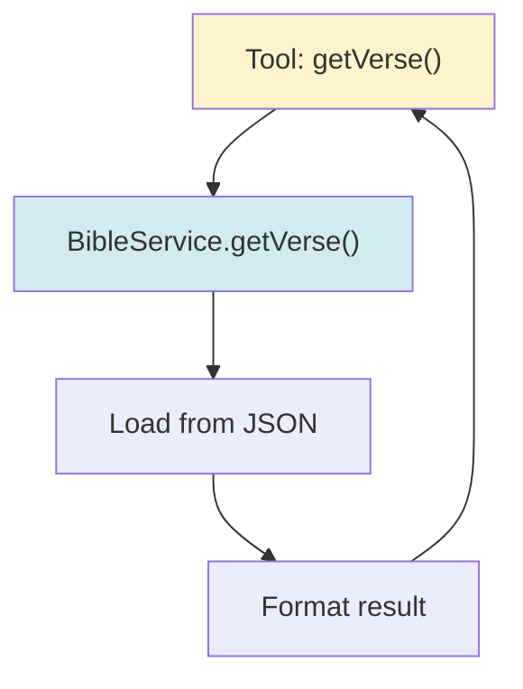

# Chapter 6: Advanced Tools

In this chapter, we'll explore advanced tool patterns, including filtering, statistics, embedding search, and tool composition.

## Complex Tool Examples

### Example 1: Filtered Statistics Tool

This tool accepts optional filters and handles complex logic:

```java
@Tool("Get statistics about a keyword: how many times it appears, " +
      "in which books, and sample references. " +
      "Optional filters: testament (1=Old Testament, 2=New Testament, null=all) " +
      "and bookType (e.g., 'Prophets', 'Gospels', 'Epistles', null=all).")
public String getKeywordStatistics(String keyword, 
                                   Integer testament, 
                                   String bookType) {
    log.info("Getting keyword statistics: {} (testament: {}, bookType: {})", 
             keyword, testament, bookType);
    
    try {
        Map<String, Object> stats = bibleService.getKeywordStatistics(
            keyword, testament, bookType);
        
        StringBuilder sb = new StringBuilder();
        sb.append("Keyword: ").append(stats.get("keyword")).append("\n");
        sb.append("Total occurrences: ").append(stats.get("totalOccurrences")).append("\n");
        sb.append("Found in ").append(stats.get("booksWithKeyword")).append(" book(s)\n\n");
        
        // Format book counts
        @SuppressWarnings("unchecked")
        Map<String, Integer> bookCounts = (Map<String, Integer>) stats.get("bookCounts");
        if (bookCounts != null && !bookCounts.isEmpty()) {
            sb.append("Occurrences by book:\n");
            bookCounts.entrySet().stream()
                .sorted(Map.Entry.<String, Integer>comparingByValue().reversed())
                .limit(10)
                .forEach(entry -> sb.append("  - ").append(entry.getKey())
                    .append(": ").append(entry.getValue()).append(" times\n"));
        }
        
        // Format sample references
        @SuppressWarnings("unchecked")
        List<String> samples = (List<String>) stats.get("sampleReferences");
        if (samples != null && !samples.isEmpty()) {
            sb.append("\nSample references:\n");
            samples.forEach(ref -> sb.append("  - ").append(ref).append("\n"));
        }
        
        return sb.toString();
    } catch (Exception e) {
        log.error("Failed to get keyword statistics", e);
        return "Error: " + e.getMessage();
    }
}
```

**Key Features:**
- Optional parameters (can be null)
- Complex data formatting
- Sorting and limiting results
- Type-safe casting with `@SuppressWarnings`

### Example 2: Embedding Search Tool

This tool uses embeddings for semantic search:

```java
@Tool("Search Bible verses using semantic similarity (embedding search). " +
      "Use this when you need to find verses that are semantically related to a topic, " +
      "even if they don't contain the exact keyword.")
public String searchVersesBySemanticSimilarity(String query, int maxResults) {
    log.info("Searching verses by semantic similarity: {} (maxResults: {})", 
             query, maxResults);
    
    try {
        // Create embedding for the query
        Embedding queryEmbedding = embeddingModel.embed(query).content();
        
        // Search embedding store
        EmbeddingSearchRequest searchRequest = EmbeddingSearchRequest.builder()
                .queryEmbedding(queryEmbedding)
                .maxResults(maxResults)
                .minScore(0.5)  // Similarity threshold
                .build();
        
        List<TextSegment> matches = bibleEmbeddingStore.search(searchRequest)
                .matches().stream()
                .map(EmbeddingMatch::embedded)
                .toList();
        
        if (matches.isEmpty()) {
            return String.format("No semantically similar verses found for: %s", query);
        }
        
        // Format results
        StringBuilder sb = new StringBuilder();
        sb.append("Semantically similar verses for '").append(query).append("':\n\n");
        for (TextSegment segment : matches) {
            sb.append(segment.text()).append("\n\n");
        }
        
        return sb.toString();
    } catch (Exception e) {
        log.error("Failed to search verses by semantic similarity", e);
        return "Error: " + e.getMessage();
    }
}
```

**Key Features:**
- Uses embedding model to create query vector
- Searches embedding store
- Configurable similarity threshold
- Returns formatted results

## Filtering and Search Tools

### Pattern: Multi-Criteria Search

```java
@Tool("Search for items with multiple filters. " +
      "All filters are optional - pass null to ignore a filter.")
public String searchItems(String keyword, 
                         String category, 
                         Integer minPrice, 
                         Integer maxPrice,
                         Boolean inStock) {
    // Build query with filters
    QueryBuilder query = new QueryBuilder();
    
    if (keyword != null && !keyword.isEmpty()) {
        query.addKeyword(keyword);
    }
    if (category != null) {
        query.addCategory(category);
    }
    if (minPrice != null) {
        query.setMinPrice(minPrice);
    }
    if (maxPrice != null) {
        query.setMaxPrice(maxPrice);
    }
    if (inStock != null) {
        query.setInStock(inStock);
    }
    
    List<Item> results = itemService.search(query.build());
    return formatResults(results);
}
```

### Pattern: Range Queries

```java
@Tool("Get verses in a range. Returns all verses from startVerse to endVerse " +
      "in the specified chapter.")
public String getVerseRange(String bookName, int chapter, 
                           int startVerse, int endVerse) {
    // Validate range
    if (startVerse > endVerse) {
        return String.format("Invalid range: start (%d) > end (%d)", 
                           startVerse, endVerse);
    }
    if (endVerse - startVerse > 100) {
        return "Range too large. Please limit to 100 verses or less.";
    }
    
    List<VerseResult> results = bibleService.getVerseRange(
        bookName, chapter, startVerse, endVerse);
    
    return formatResults(results);
}
```

## Statistics and Analysis Tools

### Pattern: Aggregation Tools

```java
@Tool("Get statistics about keyword frequency across the dataset. " +
      "Returns total count, distribution by category, and top occurrences.")
public String getKeywordStatistics(String keyword, 
                                   Integer categoryId, 
                                   String dateRange) {
    Statistics stats = analyticsService.getStatistics(keyword, categoryId, dateRange);
    
    StringBuilder sb = new StringBuilder();
    sb.append("Statistics for '").append(keyword).append("':\n\n");
    sb.append("Total occurrences: ").append(stats.getTotalCount()).append("\n");
    sb.append("Average per document: ").append(stats.getAverage()).append("\n\n");
    
    // Top categories
    sb.append("Top categories:\n");
    stats.getCategoryDistribution().entrySet().stream()
        .sorted(Map.Entry.<String, Long>comparingByValue().reversed())
        .limit(5)
        .forEach(entry -> sb.append("  - ").append(entry.getKey())
            .append(": ").append(entry.getValue()).append("\n"));
    
    return sb.toString();
}
```

### Pattern: Comparison Tools

```java
@Tool("Compare statistics between two keywords. " +
      "Shows frequency, distribution, and correlation.")
public String compareKeywords(String keyword1, String keyword2) {
    Statistics stats1 = getStatistics(keyword1);
    Statistics stats2 = getStatistics(keyword2);
    
    StringBuilder sb = new StringBuilder();
    sb.append("Comparison: '").append(keyword1).append("' vs '").append(keyword2).append("'\n\n");
    sb.append(keyword1).append(": ").append(stats1.getTotalCount()).append(" occurrences\n");
    sb.append(keyword2).append(": ").append(stats2.getTotalCount()).append(" occurrences\n\n");
    
    // Find common contexts
    Set<String> common = findCommonContexts(keyword1, keyword2);
    if (!common.isEmpty()) {
        sb.append("Common contexts:\n");
        common.forEach(ctx -> sb.append("  - ").append(ctx).append("\n"));
    }
    
    return sb.toString();
}
```

## Error Handling Patterns

### Pattern 1: Validation First

```java
@Tool("Get verse with context")
public String getVerseWithContext(String bookName, int chapter, 
                                 int verse, int contextVerses) {
    // Validate inputs first
    if (bookName == null || bookName.isEmpty()) {
        return "Error: Book name is required";
    }
    if (chapter < 1) {
        return "Error: Chapter must be positive";
    }
    if (verse < 1) {
        return "Error: Verse must be positive";
    }
    if (contextVerses < 0 || contextVerses > 10) {
        return "Error: Context verses must be between 0 and 10";
    }
    
    try {
        // Proceed with validated inputs
        List<VerseResult> results = bibleService.getVerseWithContext(
            bookName, chapter, verse, contextVerses);
        return formatResults(results);
    } catch (Exception e) {
        log.error("Failed to get verse with context", e);
        return "Error: " + e.getMessage();
    }
}
```

### Pattern 2: Graceful Degradation

```java
@Tool("Search with fallback options")
public String searchWithFallback(String query) {
    try {
        // Try primary search
        List<Result> results = primarySearch(query);
        if (!results.isEmpty()) {
            return formatResults(results);
        }
        
        // Fallback to secondary search
        results = secondarySearch(query);
        if (!results.isEmpty()) {
            return "Found " + results.size() + " results (using alternative search):\n" 
                 + formatResults(results);
        }
        
        return "No results found for: " + query;
    } catch (Exception e) {
        log.error("Search failed", e);
        return "Search temporarily unavailable. Please try again later.";
    }
}
```

### Pattern 3: Partial Results

```java
@Tool("Get comprehensive results")
public String getComprehensiveResults(String query) {
    StringBuilder sb = new StringBuilder();
    int successCount = 0;
    int errorCount = 0;
    
    // Try multiple sources
    try {
        List<Result> results1 = source1.search(query);
        sb.append("Source 1: ").append(results1.size()).append(" results\n");
        successCount++;
    } catch (Exception e) {
        sb.append("Source 1: Error - ").append(e.getMessage()).append("\n");
        errorCount++;
    }
    
    try {
        List<Result> results2 = source2.search(query);
        sb.append("Source 2: ").append(results2.size()).append(" results\n");
        successCount++;
    } catch (Exception e) {
        sb.append("Source 2: Error - ").append(e.getMessage()).append("\n");
        errorCount++;
    }
    
    if (successCount > 0) {
        sb.append("\nSome sources returned results successfully.");
    } else {
        sb.append("\nAll sources failed. Please try again.");
    }
    
    return sb.toString();
}
```

## Tool Composition Patterns

### Pattern 1: Tool Calls Service



Tools should delegate to services for business logic:

```java
@Component
@RequiredArgsConstructor
public class BibleTools {
    private final BibleService bibleService;  // Delegate to service
    
    @Tool("Get a verse")
    public String getVerse(String bookName, int chapter, int verse) {
        // Tool handles: logging, error handling, formatting
        // Service handles: business logic, data access
        VerseResult result = bibleService.getVerse(bookName, chapter, verse);
        return formatVerseResult(result);
    }
}
```

### Pattern 2: Tool Calls Multiple Services

```java
@Tool("Get comprehensive information")
public String getComprehensiveInfo(String id) {
    // Gather from multiple sources
    BasicInfo basic = basicService.get(id);
    Details details = detailService.get(id);
    Statistics stats = statsService.get(id);
    
    // Combine results
    return formatComprehensive(basic, details, stats);
}
```

### Pattern 3: Tool Validates Then Calls

```java
@Tool("Process with validation")
public String processWithValidation(String input, int value) {
    // Validate
    if (!isValid(input)) {
        return "Error: Invalid input format";
    }
    if (value < 0 || value > 100) {
        return "Error: Value must be between 0 and 100";
    }
    
    // Process
    return processService.process(input, value);
}
```

## Advanced Return Formatting

### Pattern: Structured Text Output

```java
@Tool("Get formatted statistics")
public String getFormattedStatistics(String keyword) {
    Statistics stats = getStatistics(keyword);
    
    // Use clear formatting
    StringBuilder sb = new StringBuilder();
    sb.append("=".repeat(50)).append("\n");
    sb.append("Statistics for: ").append(keyword).append("\n");
    sb.append("=".repeat(50)).append("\n\n");
    
    sb.append("Summary:\n");
    sb.append("  Total: ").append(stats.getTotal()).append("\n");
    sb.append("  Average: ").append(String.format("%.2f", stats.getAverage())).append("\n\n");
    
    sb.append("Top 5 Categories:\n");
    stats.getTopCategories(5).forEach((cat, count) -> 
        sb.append(String.format("  %-20s %5d\n", cat, count)));
    
    return sb.toString();
}
```

### Pattern: JSON-Like Output

```java
@Tool("Get data in structured format")
public String getStructuredData(String id) {
    Data data = dataService.get(id);
    
    // Format as readable structure
    return String.format(
        "ID: %s\n" +
        "Name: %s\n" +
        "Category: %s\n" +
        "Count: %d\n" +
        "Tags: %s",
        data.getId(),
        data.getName(),
        data.getCategory(),
        data.getCount(),
        String.join(", ", data.getTags())
    );
}
```

## Performance Considerations

### Limit Results

Always limit results to prevent overwhelming responses:

```java
@Tool("Search items")
public String searchItems(String keyword) {
    List<Item> results = itemService.search(keyword);
    
    // Limit to prevent huge responses
    int limit = 10;
    if (results.size() > limit) {
        results = results.subList(0, limit);
        return formatResults(results) + 
               String.format("\n\n(Showing first %d of %d results)", 
                           limit, results.size());
    }
    
    return formatResults(results);
}
```

### Cache Expensive Operations

```java
@Cacheable("statistics")
@Tool("Get statistics")
public String getStatistics(String keyword) {
    // Expensive calculation
    return calculateStatistics(keyword);
}
```

### Async Operations (Advanced)

For long-running operations, consider async patterns:

```java
@Tool("Process large dataset")
public String processLargeDataset(String datasetId) {
    // Start async processing
    CompletableFuture<String> future = processService.processAsync(datasetId);
    
    // Return immediately with status
    return "Processing started for dataset: " + datasetId + 
           ". Use checkStatus() tool to check progress.";
}
```

## Testing Advanced Tools

### Test with Filters

```java
@Test
void testGetKeywordStatisticsWithFilters() {
    // Test with all filters
    String result = bibleTools.getKeywordStatistics("love", 2, "Epistles");
    assertNotNull(result);
    assertTrue(result.contains("love"));
    assertTrue(result.contains("New Testament"));
    
    // Test with null filters
    result = bibleTools.getKeywordStatistics("love", null, null);
    assertNotNull(result);
}
```

### Test Error Cases

```java
@Test
void testGetVerseRangeInvalid() {
    // Test invalid range
    String result = bibleTools.getVerseRange("John", 3, 20, 10);
    assertTrue(result.contains("Invalid range"));
}
```

## Best Practices Summary

### ✅ Do

- **Validate inputs** before processing
- **Limit results** to reasonable sizes
- **Format output** clearly and consistently
- **Handle errors** gracefully with meaningful messages
- **Log tool calls** for debugging
- **Use services** for business logic
- **Document parameters** in tool description

### ❌ Don't

- Return unlimited results
- Ignore null/empty inputs
- Throw unhandled exceptions
- Return complex objects (use strings)
- Skip error handling
- Mix business logic in tools

## Quick Reference

### Advanced Tool Template

```java
@Tool("Comprehensive description with examples and when to use")
public String advancedTool(String requiredParam, 
                           Integer optionalParam1, 
                           String optionalParam2) {
    // 1. Validate
    if (requiredParam == null || requiredParam.isEmpty()) {
        return "Error: requiredParam is required";
    }
    
    // 2. Process
    try {
        Result result = service.process(requiredParam, optionalParam1, optionalParam2);
        
        // 3. Format
        return formatResult(result);
    } catch (Exception e) {
        log.error("Tool failed", e);
        return "Error: " + e.getMessage();
    }
}
```

## Next Steps

Now that you understand advanced tools:

1. **Chapter 10**: Create your agent with these tools
2. **Chapter 14**: Design domain-specific tools
3. **Chapter 19**: Test your tools

## Key Takeaways

✅ **Optional parameters** - Use `Integer`, `String` that can be null  
✅ **Complex formatting** - Build clear, structured output  
✅ **Error handling** - Validate, catch, and return meaningful errors  
✅ **Result limiting** - Prevent overwhelming responses  
✅ **Service delegation** - Tools call services for business logic  
✅ **Performance** - Limit, cache, consider async for long operations  
✅ **Testing** - Test filters, errors, edge cases  

**Remember:** Advanced tools are still just Java methods. Keep them focused, well-described, and error-resilient!

---

## Navigation

| [← Previous](05-building-tools) | [Home](home) | [Next →](07-rag-introduction) |
|:---|:---:|---:|
| Chapter 5: Building Tools | Building Agentic AI Applications with Java | Chapter 7: Introduction to RAG |

