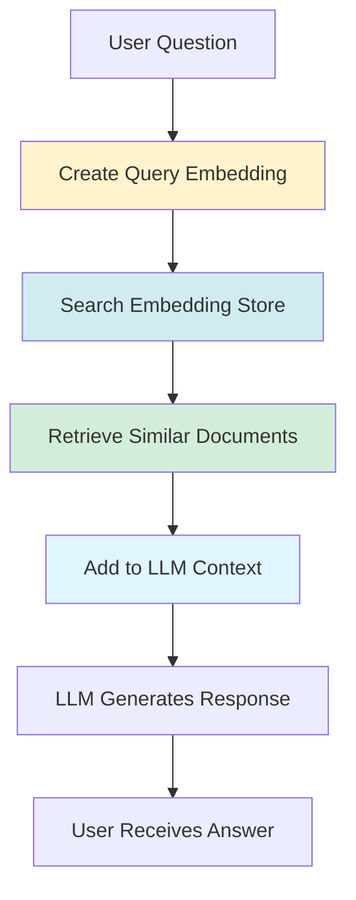
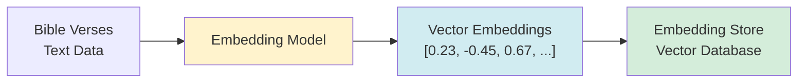
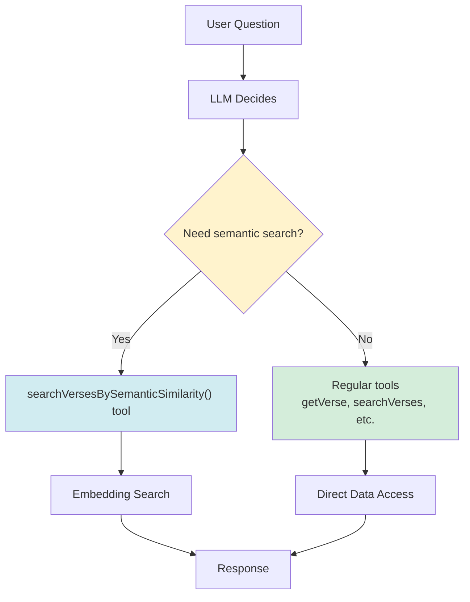
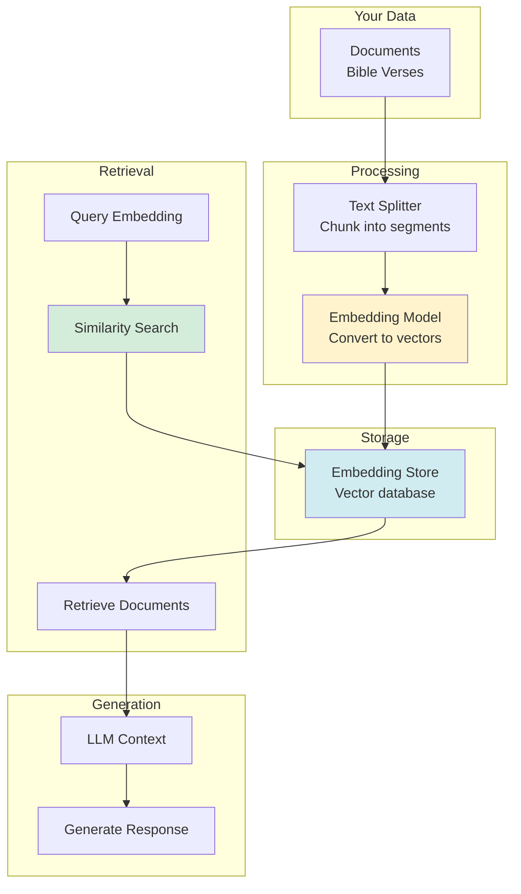

# Chapter 7: Introduction to RAG

RAG (Retrieval-Augmented Generation) is a powerful technique that enhances AI responses by retrieving relevant information from your data before generating answers. In this chapter, we'll understand what RAG is and when to use it.

## What is RAG?

**RAG** stands for **Retrieval-Augmented Generation**. It's a technique that:

1. **Retrieves** relevant information from your data
2. **Augments** the AI's context with that information
3. **Generates** responses based on the retrieved context



## Why Use RAG?

### Problem: LLM Training Data Limitations

**Without RAG:**
- LLM only knows what it was trained on
- Training data has a cutoff date
- Can't access your specific data
- May hallucinate or give outdated information

**With RAG:**
- Accesses your actual data
- Always up-to-date information
- Domain-specific knowledge
- Accurate citations and references

### Example: Bible-AI

**Without RAG:**
```
User: "What does John 3:16 say?"
LLM: "John 3:16 is a famous verse about God's love..." 
     (May be inaccurate or incomplete)
```

**With RAG:**
```
User: "What does John 3:16 say?"
RAG: Finds actual verse from Bible data
LLM: "John 3:16 For God so loved the world that he gave his one and only Son..."
     (Accurate, from actual data)
```

## How RAG Works

### Step 1: Prepare Your Data

Your data is converted into **embeddings** (vector representations):



### Step 2: User Asks Question

When user asks a question:
1. Question is converted to embedding
2. Similar embeddings are found in the store
3. Original text is retrieved
4. Added to LLM context

### Step 3: LLM Generates Response

LLM uses retrieved context to generate accurate answer.

## RAG vs. Tools

### When to Use RAG

✅ **Use RAG for:**
- Semantic search (finding conceptually similar content)
- Large document collections
- When exact keywords might not match
- Finding related information

**Example:** "What did Jesus say about love?"
- RAG finds verses about love even if they don't contain the word "love"
- Finds conceptually related verses

### When to Use Tools

✅ **Use Tools for:**
- Exact lookups (getVerse by reference)
- Structured queries (search by filters)
- Calculations and statistics
- Actions that need precise execution

**Example:** "Show me John 3:16"
- Tool: `getVerse("John", 3, 16)` - exact lookup
- More reliable than RAG for specific references

### Hybrid Approach: Reverse RAG

In Bible-AI, we use **Reverse RAG** pattern:



**Benefits:**
- LLM controls when to use embedding search
- More accurate for exact queries
- Better for Korean text (embedding model limitations)

## RAG Architecture

### Components



### 1. Document Splitting

Large documents are split into smaller chunks:

```java
Document document = Document.from(bibleText);
List<TextSegment> segments = DocumentSplitters.recursive(500, 50)
    .split(document);
```

- **500 characters**: Max chunk size
- **50 characters**: Overlap between chunks
- **Why overlap?** Preserves context at boundaries

### 2. Embedding Creation

Each chunk is converted to a vector:

```java
List<Embedding> embeddings = embeddingModel.embedAll(segments).content();
```

- **Embedding**: Numerical representation of text meaning
- **Similar text** → Similar vectors
- **Different text** → Different vectors

### 3. Storage

Embeddings are stored in an embedding store:

```java
EmbeddingStore<TextSegment> store = new InMemoryEmbeddingStore<>();
store.addAll(embeddings, segments);
```

### 4. Retrieval

When user asks a question:

```java
// 1. Create query embedding
Embedding queryEmbedding = embeddingModel.embed(userQuestion).content();

// 2. Search for similar embeddings
EmbeddingSearchRequest request = EmbeddingSearchRequest.builder()
    .queryEmbedding(queryEmbedding)
    .maxResults(3)
    .minScore(0.6)
    .build();

// 3. Retrieve similar documents
List<TextSegment> results = store.search(request).matches().stream()
    .map(EmbeddingMatch::embedded)
    .toList();
```

### 5. Augmentation

Retrieved documents are added to LLM context:

```java
String context = results.stream()
    .map(TextSegment::text)
    .collect(Collectors.joining("\n\n"));

String prompt = context + "\n\nUser question: " + userQuestion;
String response = llm.generate(prompt);
```

## RAG Limitations

### 1. Embedding Model Language Support

**Problem:** Most embedding models are trained on English
- All-MiniLM-L6-v2: English model
- Korean text: Less accurate semantic search

**Solution in Bible-AI:**
- Use tools for Korean text (more reliable)
- Use RAG as a tool (Reverse RAG pattern)
- Consider multilingual embedding models

### 2. Chunk Size Trade-offs

**Small chunks (200 chars):**
- ✅ More precise retrieval
- ❌ May lose context
- ❌ More chunks to search

**Large chunks (1000 chars):**
- ✅ Better context
- ❌ Less precise retrieval
- ❌ May include irrelevant info

**Recommended:** 500 characters with 50 overlap

### 3. Similarity Threshold

**High threshold (0.8):**
- ✅ Very relevant results
- ❌ May miss some relevant content

**Low threshold (0.5):**
- ✅ Finds more content
- ❌ May include irrelevant results

**Recommended:** 0.6 for balanced results

## When NOT to Use RAG

### ❌ Don't Use RAG For:

1. **Exact lookups**
   - Use: `getVerse("John", 3, 16)` tool
   - RAG may return similar but not exact verses

2. **Structured queries**
   - Use: `getKeywordStatistics(keyword, testament, bookType)` tool
   - RAG can't filter by structured fields

3. **Real-time data**
   - RAG uses pre-computed embeddings
   - Tools can access live data

4. **Small, well-structured data**
   - If you can query directly, use tools
   - RAG adds complexity without benefit

## RAG Patterns

### Pattern 1: Automatic RAG

RAG is automatically used for every query:

```java
BibleAssistant assistant = AiServices.builder(BibleAssistant.class)
    .chatModel(chatModel)
    .contentRetriever(ragRetriever)  // Automatic RAG
    .build();
```

**Pros:** Simple, always uses RAG
**Cons:** Less control, may retrieve irrelevant content

### Pattern 2: Reverse RAG (Recommended)

RAG is available as a tool - LLM decides when to use it:

```java
BibleAssistant assistant = AiServices.builder(BibleAssistant.class)
    .chatModel(chatModel)
    .tools(bibleTools)  // Includes searchVersesBySemanticSimilarity()
    // No automatic contentRetriever
    .build();
```

**Pros:** Better control, more accurate
**Cons:** Requires tool implementation

**Bible-AI uses this pattern!**

## Quick Comparison

| Aspect | RAG | Tools |
|--------|-----|-------|
| **Best for** | Semantic search | Exact queries |
| **Accuracy** | Conceptual similarity | Precise matches |
| **Setup** | More complex | Simpler |
| **Control** | Less control | Full control |
| **Language** | English better | Language agnostic |
| **Real-time** | Pre-computed | Can be live |

## Next Steps

Now that you understand RAG:

1. **Chapter 8**: Set up embeddings
2. **Chapter 9**: Implement RAG
3. **Chapter 10**: Create your agent

## Key Takeaways

✅ **RAG** = Retrieve relevant data, augment LLM context, generate response  
✅ **Use RAG** for semantic search in large document collections  
✅ **Use Tools** for exact lookups and structured queries  
✅ **Reverse RAG** = RAG as a tool (better control)  
✅ **Embeddings** = Vector representations of text meaning  
✅ **Chunk size** matters (500 chars recommended)  
✅ **Similarity threshold** balances precision and recall (0.6 recommended)  

**Remember:** RAG is powerful but not always the best choice. Use tools for exact queries, RAG for semantic search!

---

## Navigation

| [← Previous](06-advanced-tools) | [Home](home) | [Next →](08-setting-up-embeddings) |
|:---|:---:|---:|
| Chapter 6: Advanced Tools | Building Agentic AI Applications with Java | Chapter 8: Setting Up Embeddings |

