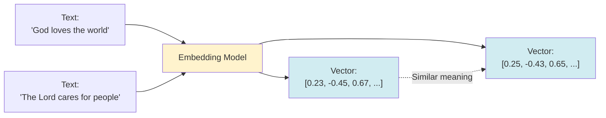

# Chapter 8: Setting Up Embeddings

Embeddings are vector representations of text that enable semantic search. In this chapter, we'll learn how to set up and configure embedding models for RAG.

## What are Embeddings?

**Embeddings** are numerical vectors that represent the meaning of text. Similar text has similar vectors, enabling semantic search.



**Key Properties:**
- **Similar meaning** → Similar vectors (close in vector space)
- **Different meaning** → Different vectors (far in vector space)
- **Fixed dimension** (e.g., 384 dimensions for All-MiniLM-L6-v2)

## Choosing an Embedding Model

### All-MiniLM-L6-v2 (Recommended for Start)

**Why use it:**
- ✅ Small and fast
- ✅ Quantized (runs locally, no API needed)
- ✅ Good for English text
- ✅ ONNX-based (efficient)

**Limitations:**
- ❌ English-focused (Korean text less accurate)
- ❌ Smaller dimension (384) vs. larger models

### Other Options

**For English:**
- `BgeSmallEnV15QuantizedEmbeddingModel` - Better quality
- `OpenAiEmbeddingModel` - Requires API key

**For Multilingual:**
- `BgeSmallZhV15QuantizedEmbeddingModel` - Chinese
- Consider specialized models for your language

## Setting Up All-MiniLM-L6-v2

### Step 1: Add Dependency

In `pom.xml`:

```xml
<dependency>
    <groupId>dev.langchain4j</groupId>
    <artifactId>langchain4j-embeddings-all-minilm-l6-v2-q</artifactId>
    <version>1.2.0-beta8</version>
</dependency>
```

**Note:** The `-q` suffix means "quantized" - optimized for local execution.

### Step 2: Create Embedding Model Bean

```java
package io.github.nicechester.bibleai.config;

import dev.langchain4j.model.embedding.EmbeddingModel;
import dev.langchain4j.model.embedding.onnx.allminilml6v2q.AllMiniLmL6V2QuantizedEmbeddingModel;
import org.springframework.context.annotation.Bean;
import org.springframework.context.annotation.Configuration;

@Configuration
public class RAGConfig {
    
    @Bean
    public EmbeddingModel embeddingModel() {
        return new AllMiniLmL6V2QuantizedEmbeddingModel();
    }
}
```

**That's it!** The model downloads automatically on first use.

### Step 3: Understanding ONNX

**ONNX** (Open Neural Network Exchange) is a format for running ML models efficiently.

**What you'll see:**
```
[INFO] Loading ONNX model...
[INFO] ONNX Runtime initialized
```

**This is normal!** The model is loading. No action needed.

## Loading and Preparing Data

### Step 1: Load Your Data

```java
@Bean
public EmbeddingStore<TextSegment> bibleEmbeddingStore(
        EmbeddingModel embeddingModel,
        @Value("${bible.data.json-path}") String bibleJsonPath) {
    
    // Load Bible JSON
    Resource resource = resourceLoader.getResource(bibleJsonPath);
    InputStream inputStream = resource.getInputStream();
    JsonNode root = objectMapper.readTree(inputStream);
    
    // Convert to text format
    StringBuilder content = new StringBuilder();
    // ... parse JSON and build text ...
    
    return createEmbeddingStore(content.toString(), embeddingModel);
}
```

### Step 2: Format Your Data

Format data consistently for better retrieval:

```java
// Format: "[ASV] Genesis 1:1 In the beginning..."
content.append("[").append(versionName).append("] ")
    .append(bookName)
    .append(" ").append(chapterNum).append(":").append(verseNum);
if (title != null && !title.isEmpty()) {
    content.append(" <").append(title).append(">");
}
content.append(" ").append(text).append("\n");
```

**Why format?**
- Includes metadata (version, book, chapter, verse)
- Makes retrieval results more useful
- Provides context for LLM

### Step 3: Split into Segments

```java
Document document = Document.from(content.toString());
List<TextSegment> segments = DocumentSplitters.recursive(
    maxSegmentSize,    // 500 characters
    maxOverlapSize     // 50 characters
).split(document);
```

**Parameters:**
- **maxSegmentSize**: Maximum characters per chunk (500 recommended)
- **maxOverlapSize**: Overlap between chunks (50 recommended)

**Why overlap?**
- Preserves context at chunk boundaries
- Prevents losing information when splitting

## Creating Embeddings

### Step 1: Generate Embeddings

```java
List<Embedding> embeddings = embeddingModel.embedAll(segments).content();
```

**What happens:**
- Each text segment → embedding vector
- Batch processing (efficient)
- Returns list of embeddings

### Step 2: Store in Embedding Store

```java
EmbeddingStore<TextSegment> store = new InMemoryEmbeddingStore<>();
store.addAll(embeddings, segments);
```

**InMemoryEmbeddingStore:**
- ✅ Simple, no setup needed
- ✅ Fast for development
- ❌ Lost on restart
- ❌ Limited by memory

**For production:** Consider Redis or other persistent stores.

## Configuration

### application.yml

```yaml
langchain4j:
  splitter:
    text:
      maxSegmentSize: 500
      maxOverlapSize: 50

bible:
  rag:
    max-results: 3      # How many segments to retrieve
    min-score: 0.6      # Similarity threshold (0.0-1.0)
```

### Understanding Parameters

**maxSegmentSize (500):**
- Larger = more context per chunk
- Smaller = more precise retrieval
- **500 is a good balance**

**maxOverlapSize (50):**
- Prevents information loss at boundaries
- **50 is typically sufficient**

**max-results (3):**
- How many similar segments to retrieve
- More = more context, but may include irrelevant content
- **3-5 is usually good**

**min-score (0.6):**
- Similarity threshold (0.0 = any match, 1.0 = exact match)
- Higher = more relevant but may miss some
- Lower = finds more but may include irrelevant
- **0.6 is a good balance**

## Multilingual Considerations

### The Challenge

**All-MiniLM-L6-v2** is trained on English:
- ✅ Excellent for English text
- ⚠️ Works for other languages but less accurate
- ❌ May return irrelevant results for non-English

### Solutions

**Option 1: Use Tools for Non-English (Recommended)**
```java
// For Korean text, use keyword search tools
// Don't rely on embedding search
```

**Option 2: Multilingual Embedding Model**
```java
// Use a model trained on multiple languages
// More complex setup, better accuracy
```

**Option 3: Hybrid Approach (Bible-AI Pattern)**
- Tools for exact queries (language agnostic)
- Embedding search as a tool (use with caution for non-English)
- LLM decides which to use

## Complete Example

Here's a complete RAG setup from Bible-AI:

```java
@Configuration
public class RAGConfig {
    
    private final ResourceLoader resourceLoader;
    private final ObjectMapper objectMapper;
    
    @Bean
    public EmbeddingModel embeddingModel() {
        return new AllMiniLmL6V2QuantizedEmbeddingModel();
    }
    
    @Bean
    public EmbeddingStore<TextSegment> bibleEmbeddingStore(
            EmbeddingModel embeddingModel,
            @Value("${langchain4j.splitter.text.maxSegmentSize:500}") int maxSegmentSize,
            @Value("${langchain4j.splitter.text.maxOverlapSize:50}") int maxOverlapSize,
            @Value("${bible.data.json-path}") String bibleJsonPath,
            @Value("${bible.data.asv-json-path}") String asvJsonPath) {
        
        StringBuilder bibleContent = new StringBuilder();
        
        // Load Korean Bible
        loadBibleJson(bibleJsonPath, bibleContent, "KRV");
        
        // Load English Bible (better for embeddings)
        loadBibleJson(asvJsonPath, bibleContent, "ASV");
        
        // Create document
        Document document = Document.from(bibleContent.toString());
        
        // Split into segments
        List<TextSegment> segments = DocumentSplitters.recursive(
            maxSegmentSize, maxOverlapSize).split(document);
        
        // Create embeddings
        List<Embedding> embeddings = embeddingModel.embedAll(segments).content();
        
        // Store
        EmbeddingStore<TextSegment> store = new InMemoryEmbeddingStore<>();
        store.addAll(embeddings, segments);
        
        log.info("Loaded {} segments into embedding store", segments.size());
        return store;
    }
    
    private void loadBibleJson(String jsonPath, StringBuilder content, String version) {
        // Load and format Bible data
        // ...
    }
}
```

## Performance Considerations

### Startup Time

**First run:**
- Model downloads (~50MB)
- Embeddings created for all data
- May take 1-2 minutes for large datasets

**Subsequent runs:**
- Model loads from cache
- Embeddings already created
- Much faster

### Memory Usage

**Embedding Store:**
- Each embedding: ~1.5KB (384 dimensions × 4 bytes)
- 100,000 segments: ~150MB
- Consider memory limits for large datasets

### Optimization Tips

1. **Filter data** before embedding (only embed what you need)
2. **Use quantized models** (smaller, faster)
3. **Consider persistent storage** for production (Redis, etc.)
4. **Batch embedding creation** (already done by `embedAll()`)

## Troubleshooting

### Issue 1: ONNX Logs

**You see:**
```
[INFO] Loading ONNX model...
[INFO] ONNX Runtime initialized
```

**Solution:** This is normal! The embedding model is initializing.

### Issue 2: Slow Embedding Creation

**Problem:** Creating embeddings takes a long time

**Solutions:**
- Use quantized models (faster)
- Reduce data size
- Create embeddings once, store persistently

### Issue 3: Poor Search Results

**Problem:** Embedding search returns irrelevant results

**Solutions:**
- Increase `min-score` threshold
- Check if embedding model supports your language
- Consider using tools instead for exact queries
- Verify data formatting is consistent

## Quick Reference

### Basic Setup

```java
@Bean
public EmbeddingModel embeddingModel() {
    return new AllMiniLmL6V2QuantizedEmbeddingModel();
}

@Bean
public EmbeddingStore<TextSegment> embeddingStore(EmbeddingModel model) {
    // Load data, split, embed, store
    // ...
}
```

### Configuration

```yaml
langchain4j:
  splitter:
    text:
      maxSegmentSize: 500
      maxOverlapSize: 50
```

### Creating Embeddings

```java
List<TextSegment> segments = DocumentSplitters.recursive(500, 50)
    .split(document);
List<Embedding> embeddings = embeddingModel.embedAll(segments).content();
store.addAll(embeddings, segments);
```

## Next Steps

Now that you can set up embeddings:

1. **Chapter 9**: Implement RAG retrieval
2. **Chapter 10**: Create your agent with RAG
3. **Chapter 22**: Explore custom embedding models

## Key Takeaways

✅ **Embeddings** = Vector representations of text meaning  
✅ **All-MiniLM-L6-v2** = Good starting point (quantized, local)  
✅ **Chunk size** = 500 chars with 50 overlap (recommended)  
✅ **ONNX logs** = Normal during model initialization  
✅ **English models** = Less accurate for other languages  
✅ **Format data** = Include metadata for better results  
✅ **Memory store** = Simple for dev, consider Redis for production  

**Remember:** Embeddings enable semantic search, but tools are often more reliable for exact queries!

---

## Navigation

| [← Previous](07-rag-introduction) | [Home](home) | [Next →](09-implementing-rag) |
|:---|:---:|---:|
| Chapter 7: Introduction to RAG | Building Agentic AI Applications with Java | Chapter 9: Implementing RAG |

