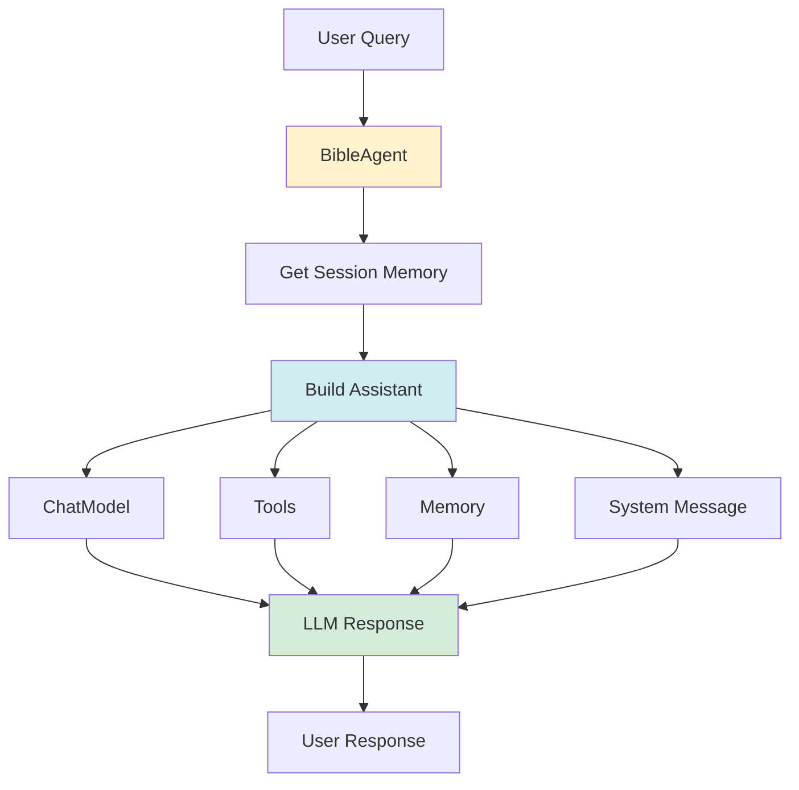

# Chapter 10: Creating Your Agent

Now that you have all the pieces (LLM, tools, RAG, memory), let's put them together to create your AI agent!

## Agent Architecture



## Step-by-Step Agent Creation

### Step 1: Define Agent Interface

```java
public interface BibleAssistant {
    String chat(@UserMessage String userMessage);
}
```

**Key points:**
- Interface defines the agent's API
- `@UserMessage` marks user input
- Return type is `String` (response)

### Step 2: Create Agent Service

```java
@Service
@RequiredArgsConstructor
public class BibleAgent {
    private final ChatModel chatModel;
    private final BibleTools bibleTools;
    private final SessionMemoryManager sessionMemoryManager;
    
    public String handleQuery(String userQuery, String sessionId) {
        // Implementation
    }
}
```

### Step 3: Get Session Memory

```java
ChatMemory sessionMemory = sessionMemoryManager.getOrCreateMemory(sessionId);
```

### Step 4: Build System Message

```java
String systemMessage = """
    You are a Bible study assistant.
    Always provide accurate verse references.
    Use tools to get actual Bible data.
    """;
```

### Step 5: Build Assistant

```java
BibleAssistant assistant = AiServices.builder(BibleAssistant.class)
    .chatModel(chatModel)
    .chatMemory(sessionMemory)
    .tools(bibleTools)
    .systemMessageProvider(chatId -> systemMessage)
    .build();
```

### Step 6: Call Agent

```java
return assistant.chat(userQuery);
```

## Complete Example: Bible-AI Agent

```java
@Log4j2
@Service
@RequiredArgsConstructor
public class BibleAgent {
    private final BibleTools bibleTools;
    private final SessionMemoryManager sessionMemoryManager;
    private final ChatModel chatModel;
    
    public interface BibleAssistant {
        String chat(@UserMessage String userMessage);
    }
    
    public String handleQuery(String userQuery, String sessionId) {
        ChatMemory sessionMemory = null;
        try {
            // Get or create session-specific memory
            sessionMemory = sessionMemoryManager.getOrCreateMemory(sessionId);
            
            // Gemini function-calling constraint: clear memory if too large
            if (sessionMemory.messages().size() >= 8) {
                log.warn("Session memory too large ({} messages), clearing for Gemini compatibility", 
                        sessionMemory.messages().size());
                sessionMemoryManager.clearSession(sessionId);
                sessionMemory = sessionMemoryManager.getOrCreateMemory(sessionId);
            }
            
            String systemMessage = buildSystemMessage();
            
            // Build assistant
            BibleAssistant assistant = AiServices.builder(BibleAssistant.class)
                .chatModel(chatModel)
                .chatMemory(sessionMemory)
                .tools(bibleTools)
                .systemMessageProvider(chatId -> systemMessage)
                .build();
            
            // Get response
            String response = assistant.chat(userQuery);
            log.info("Generated response (length: {})", response.length());
            return response;
            
        } catch (Exception e) {
            log.error("Failed to handle query", e);
            throw new RuntimeException("Failed to process query: " + e.getMessage(), e);
        }
    }
    
    private String buildSystemMessage() {
        return """
            You are a Bible study assistant for the Korean Revised Version (개역개정) Bible.
            You help users understand and search the Bible through natural language.
            
            CRITICAL: EMBEDDING SEARCH AS A TOOL (Reverse RAG Pattern)
            - Embedding search is available as a tool: searchVersesBySemanticSimilarity()
            - LLM decides when to use embedding search, not automatic RAG
            - The embedding model has limitations with Korean text
            - When using searchVersesBySemanticSimilarity():
              * Always verify results are from correct books
              * If results are from wrong books, ignore them
              * Use other search tools for more accurate results
            - Prefer keyword-based search tools over semantic search for Korean text
            
            Key principles:
            1. ALWAYS use BibleTools FIRST - do NOT rely on RAG results for Korean text
            2. Always provide accurate verse references (book name, chapter, verse)
            3. When quoting verses, include the full reference (e.g., "창세기 1:1")
            4. Use the search tools to find relevant verses when users ask about topics
            5. Provide context and explanations when helpful
            6. Support questions in Korean and English
            
            Available tools:
            - getVerse(bookName, chapter, verse): Get a specific verse
            - getChapter(bookName, chapter): Get all verses in a chapter
            - searchVerses(keyword): Search for verses containing a keyword
            - getKeywordStatistics(keyword, testament, bookType): Get statistics
            - searchVersesBySemanticSimilarity(query, maxResults): Semantic search
            """;
    }
}
```

## System Message Best Practices

### ✅ Good System Message

```java
String systemMessage = """
    You are a Bible study assistant.
    
    Key principles:
    1. Always use tools to get actual Bible data
    2. Provide accurate verse references
    3. Explain context when helpful
    
    Available tools:
    - getVerse(bookName, chapter, verse): Get a specific verse
    - searchVerses(keyword): Search for verses
    """;
```

**Why it's good:**
- Clear role definition
- Specific instructions
- Lists available tools
- Sets expectations

### ❌ Bad System Message

```java
String systemMessage = "You are helpful.";
```

**Why it's bad:**
- Too vague
- No guidance
- Doesn't explain tools
- LLM doesn't know what to do

## Memory Management

### Session-Based Memory

```java
ChatMemory sessionMemory = sessionMemoryManager.getOrCreateMemory(sessionId);
```

**Benefits:**
- Each user has their own conversation history
- Multi-turn conversations work
- Can clear individual sessions

### Memory Size Limits

```java
// In SessionMemoryManager
private static final int MAX_MESSAGES_PER_SESSION = 10;

ChatMemory memory = MessageWindowChatMemory.withMaxMessages(MAX_MESSAGES_PER_SESSION);
```

**Why limit?**
- Prevents memory overflow
- Reduces API costs
- Faster responses
- Gemini function-calling constraints

### Clearing Memory

```java
// Clear when memory gets too large (Gemini constraint)
if (sessionMemory.messages().size() >= 8) {
    sessionMemoryManager.clearSession(sessionId);
    sessionMemory = sessionMemoryManager.getOrCreateMemory(sessionId);
}
```

## Error Handling

### Try-Catch Wrapper

```java
public String handleQuery(String userQuery, String sessionId) {
    try {
        // Agent logic
        return assistant.chat(userQuery);
    } catch (Exception e) {
        log.error("Failed to handle query", e);
        throw new RuntimeException("Failed to process query: " + e.getMessage(), e);
    }
}
```

### Graceful Degradation

```java
try {
    return assistant.chat(userQuery);
} catch (dev.langchain4j.exception.HttpException e) {
    log.error("LLM API error", e);
    return "I'm having trouble connecting to the AI service. Please try again.";
} catch (Exception e) {
    log.error("Unexpected error", e);
    return "I encountered an error. Please try rephrasing your question.";
}
```

## Testing Your Agent

### Unit Test

```java
@SpringBootTest
class BibleAgentTest {
    
    @Autowired
    private BibleAgent bibleAgent;
    
    @Test
    void testSimpleQuery() {
        String response = bibleAgent.handleQuery("Show me John 3:16", "test-session");
        assertNotNull(response);
        assertTrue(response.contains("John 3:16") || response.contains("John"));
    }
    
    @Test
    void testSessionMemory() {
        // First query
        bibleAgent.handleQuery("What is love?", "session-1");
        
        // Second query (should remember context)
        String response = bibleAgent.handleQuery("Tell me more", "session-1");
        assertNotNull(response);
    }
}
```

## Advanced Patterns

### Pattern 1: Conditional RAG

```java
BibleAssistant assistant = AiServices.builder(BibleAssistant.class)
    .chatModel(chatModel)
    .tools(bibleTools)
    // Conditionally add RAG
    .contentRetriever(useRAG ? bibleRetriever : null)
    .build();
```

### Pattern 2: Multiple Tools

```java
BibleAssistant assistant = AiServices.builder(BibleAssistant.class)
    .chatModel(chatModel)
    .tools(bibleTools, analyticsTools, formattingTools)  // Multiple tool classes
    .build();
```

### Pattern 3: Dynamic System Message

```java
.systemMessageProvider(chatId -> {
    // Customize system message per session
    if (isAdminSession(chatId)) {
        return adminSystemMessage;
    }
    return defaultSystemMessage;
})
```

## Best Practices

### ✅ Do

- **Define clear system messages** with role and instructions
- **Use session-based memory** for multi-turn conversations
- **Limit memory size** to prevent issues
- **Handle errors gracefully** with try-catch
- **Log agent calls** for debugging
- **Test your agent** with various queries

### ❌ Don't

- Use vague system messages
- Ignore memory limits
- Let exceptions crash the app
- Skip error handling
- Forget to test

## Quick Reference

### Basic Agent Template

```java
@Service
@RequiredArgsConstructor
public class MyAgent {
    private final ChatModel chatModel;
    private final MyTools myTools;
    private final SessionMemoryManager memoryManager;
    
    public interface MyAssistant {
        String chat(@UserMessage String message);
    }
    
    public String handleQuery(String query, String sessionId) {
        ChatMemory memory = memoryManager.getOrCreateMemory(sessionId);
        
        MyAssistant assistant = AiServices.builder(MyAssistant.class)
            .chatModel(chatModel)
            .chatMemory(memory)
            .tools(myTools)
            .systemMessageProvider(chatId -> systemMessage)
            .build();
        
        return assistant.chat(query);
    }
}
```

## Next Steps

Now that you can create agents:

1. **Chapter 11**: Manage sessions properly
2. **Chapter 12**: Advanced agent patterns
3. **Chapter 15**: Expose via REST API

## Key Takeaways

✅ **Agent interface** = Defines the API  
✅ **AiServices.builder()** = Main way to create agents  
✅ **System message** = Critical for agent behavior  
✅ **Session memory** = Enables multi-turn conversations  
✅ **Error handling** = Essential for production  
✅ **Testing** = Verify agent works correctly  

**Remember:** An agent is just LLM + Tools + Memory + Instructions. Put them together and you have an AI agent!

---

## Navigation

| [← Previous](09-implementing-rag) | [Home](home) | [Next →](11-session-management) |
|:---|:---:|---:|
| Chapter 9: Implementing RAG | Building Agentic AI Applications with Java | Chapter 11: Session Management |

