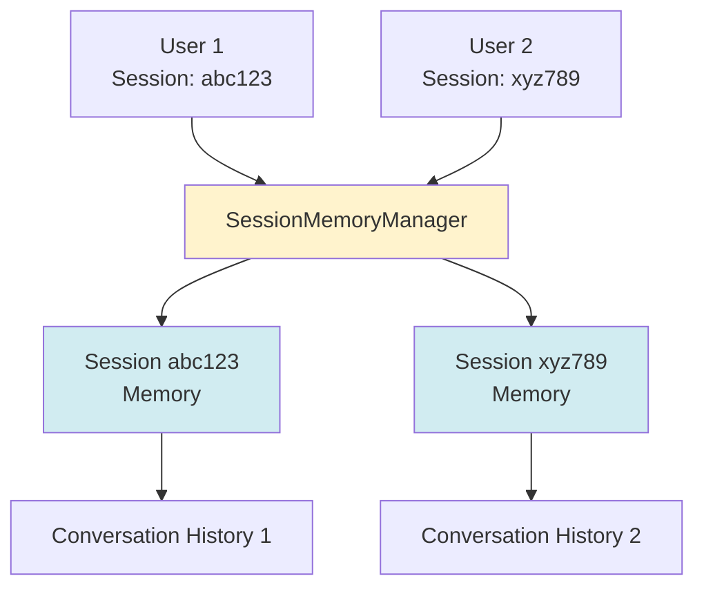

# Chapter 11: Session Management

Session management enables multi-turn conversations by maintaining conversation history per user. In this chapter, we'll learn how to implement and manage sessions.

## What is Session Management?

**Session management** maintains separate conversation histories for different users or conversations. Each session has its own memory.



## Why Session Management?

### Without Sessions

- All users share the same memory
- Conversations get mixed up
- No multi-turn context

### With Sessions

- Each user has separate memory
- Conversations stay isolated
- Multi-turn conversations work

## Implementing SessionMemoryManager

### Basic Implementation

```java
@Service
public class SessionMemoryManager {
    
    private static final int MAX_MESSAGES_PER_SESSION = 10;
    private static final long SESSION_TIMEOUT_MS = 30 * 60 * 1000; // 30 minutes
    
    private final Map<String, SessionMemoryEntry> sessionMemories = new ConcurrentHashMap<>();
    
    public ChatMemory getOrCreateMemory(String sessionId) {
        if (sessionId == null || sessionId.isEmpty()) {
            // Return ephemeral memory for anonymous users
            return MessageWindowChatMemory.withMaxMessages(MAX_MESSAGES_PER_SESSION);
        }
        
        SessionMemoryEntry entry = sessionMemories.compute(sessionId, (key, existing) -> {
            if (existing == null) {
                log.info("Creating new session memory for sessionId: {}", sessionId);
                ChatMemory newMemory = MessageWindowChatMemory.withMaxMessages(MAX_MESSAGES_PER_SESSION);
                return new SessionMemoryEntry(newMemory, Instant.now());
            } else {
                existing.updateLastAccess();
                return existing;
            }
        });
        
        return entry.memory();
    }
    
    public void clearSession(String sessionId) {
        if (sessionId != null && !sessionId.isEmpty()) {
            SessionMemoryEntry removed = sessionMemories.remove(sessionId);
            if (removed != null) {
                log.info("Cleared session memory for sessionId: {}", sessionId);
            }
        }
    }
    
    private static class SessionMemoryEntry {
        private final ChatMemory memory;
        private volatile Instant lastAccess;
        
        public SessionMemoryEntry(ChatMemory memory, Instant lastAccess) {
            this.memory = memory;
            this.lastAccess = lastAccess;
        }
        
        public ChatMemory memory() { return memory; }
        public Instant lastAccess() { return lastAccess; }
        public void updateLastAccess() { this.lastAccess = Instant.now(); }
    }
}
```

## Session Cleanup

### Automatic Cleanup

```java
@Scheduled(fixedRate = 10 * 60 * 1000) // Every 10 minutes
public void cleanupExpiredSessions() {
    Instant now = Instant.now();
    int cleanedCount = 0;
    
    for (Map.Entry<String, SessionMemoryEntry> entry : sessionMemories.entrySet()) {
        long idleTimeMs = now.toEpochMilli() - entry.getValue().lastAccess().toEpochMilli();
        if (idleTimeMs > SESSION_TIMEOUT_MS) {
            sessionMemories.remove(entry.getKey());
            cleanedCount++;
        }
    }
    
    if (cleanedCount > 0) {
        log.info("Cleaned up {} expired sessions. Active sessions: {}", 
                cleanedCount, sessionMemories.size());
    }
}
```

**Why cleanup?**
- Prevents memory leaks
- Removes inactive sessions
- Keeps memory usage reasonable

## Memory Size Management

### Gemini Function-Calling Constraint

Gemini requires function calls to come immediately after user turn or function response. Large memory can cause ordering issues.

```java
public String handleQuery(String userQuery, String sessionId) {
    ChatMemory sessionMemory = sessionMemoryManager.getOrCreateMemory(sessionId);
    
    // Clear memory if too large (Gemini constraint)
    if (sessionMemory.messages().size() >= 8) {
        log.warn("Session memory too large, clearing for Gemini compatibility");
        sessionMemoryManager.clearSession(sessionId);
        sessionMemory = sessionMemoryManager.getOrCreateMemory(sessionId);
    }
    
    // Build and use agent
    // ...
}
```

### Configurable Limits

```java
@Value("${bible.session.max-messages:10}")
private int maxMessagesPerSession;

ChatMemory memory = MessageWindowChatMemory.withMaxMessages(maxMessagesPerSession);
```

## Session ID Generation

### Frontend Generation

```javascript
// Generate UUID for session
const sessionId = crypto.randomUUID();
```

### Backend Generation

```java
@PostMapping("/query")
public ResponseEntity<QueryResponse> query(@RequestBody QueryRequest request) {
    String sessionId = request.sessionId();
    if (sessionId == null || sessionId.isEmpty()) {
        sessionId = UUID.randomUUID().toString();
    }
    // Use sessionId
}
```

## Session Statistics

### Track Active Sessions

```java
public int getActiveSessionCount() {
    return sessionMemories.size();
}

public Map<String, Integer> getSessionStatistics() {
    Map<String, Integer> stats = new HashMap<>();
    stats.put("activeSessions", sessionMemories.size());
    stats.put("maxMessagesPerSession", MAX_MESSAGES_PER_SESSION);
    return stats;
}
```

## Best Practices

### ✅ Do

- **Use ConcurrentHashMap** for thread safety
- **Set reasonable timeouts** (30 minutes)
- **Limit memory size** per session
- **Clean up expired sessions** automatically
- **Log session operations** for debugging
- **Handle null session IDs** gracefully

### ❌ Don't

- Store sessions forever (memory leak)
- Use unlimited memory size
- Ignore thread safety
- Skip cleanup
- Forget to handle null sessions

## Quick Reference

### Basic Session Manager

```java
@Service
public class SessionMemoryManager {
    private final Map<String, ChatMemory> memories = new ConcurrentHashMap<>();
    
    public ChatMemory getOrCreateMemory(String sessionId) {
        return memories.computeIfAbsent(sessionId, 
            id -> MessageWindowChatMemory.withMaxMessages(10));
    }
    
    public void clearSession(String sessionId) {
        memories.remove(sessionId);
    }
}
```

### Using in Agent

```java
ChatMemory memory = sessionMemoryManager.getOrCreateMemory(sessionId);
BibleAssistant assistant = AiServices.builder(BibleAssistant.class)
    .chatModel(chatModel)
    .chatMemory(memory)
    .build();
```

## Next Steps

Now that you can manage sessions:

1. **Chapter 12**: Advanced agent patterns
2. **Chapter 15**: REST API with sessions
3. **Chapter 18**: Performance optimization

## Key Takeaways

✅ **Session management** = Separate memory per user/session  
✅ **ConcurrentHashMap** = Thread-safe storage  
✅ **Automatic cleanup** = Prevents memory leaks  
✅ **Memory limits** = Prevents overflow and API issues  
✅ **Session IDs** = Unique identifier per conversation  
✅ **Timeout** = Removes inactive sessions  

**Remember:** Sessions enable multi-turn conversations. Manage them carefully to prevent memory issues!

---

## Navigation

| [← Previous](10-creating-your-agent) | [Home](home) | [Next →](12-advanced-agent-patterns) |
|:---|:---:|---:|
| Chapter 10: Creating Your Agent | Building Agentic AI Applications with Java | Chapter 12: Advanced Agent Patterns |

