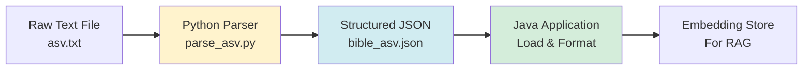

# Chapter 13: Data Preparation

Preparing your data correctly is crucial for good RAG results. In this chapter, we'll learn how to format and prepare data for embedding and retrieval.

## Data Formatting Principles

### Include Metadata

**Bad:**
```
In the beginning God created the heavens and the earth.
```

**Good:**
```
[ASV] Genesis 1:1 In the beginning God created the heavens and the earth.
```

**Why?**
- Provides context (book, chapter, verse)
- Makes retrieval results more useful
- Helps LLM understand source

### Consistent Formatting

**Bad:**
```
Gen 1:1 In the beginning...
Genesis 1:1 In the beginning...
1:1 In the beginning...
```

**Good:**
```
[ASV] Genesis 1:1 In the beginning...
[ASV] Genesis 1:2 And the earth...
[ASV] Genesis 1:3 And God said...
```

**Why?**
- Consistent format improves retrieval
- Easier to parse results
- Better for LLM understanding

## Converting Raw Text to JSON

Before we can use data in our Java application, we often need to convert raw text files into structured JSON. Let's see how we parse the ASV (American Standard Version) Bible text file.

### ASV Text Format

The ASV text file (`asv.txt`) has a simple structure:

```
American Standard Version

This Bible is in the Public Domain.

Genesis

Chapter 1

1 In the beginning God created the heavens and the earth.
2 And the earth was waste and void; and darkness was upon the face of the deep:
and the Spirit of God moved upon the face of the waters.
3 And God said, Let there be light: and there was light.
```

**Format:**
- Book name on its own line (e.g., "Genesis")
- Chapter header: "Chapter 1"
- Verses: Number followed by text (e.g., "1 In the beginning...")
- Multi-line verses: Continue on next lines until next verse number

### Python Parsing Script

Here's the complete Python script (`parse_asv.py`) that converts this text into structured JSON:

```python
#!/usr/bin/env python3
"""
Parse American Standard Version (ASV) Bible text file into structured JSON.
Input format:
  Genesis
  Chapter 1
  1 In the beginning God created...
  2 And the earth was waste...
"""

import json
import re
import sys
from pathlib import Path

# Book name mapping (ASV uses full names)
BOOK_NAMES = [
    "Genesis", "Exodus", "Leviticus", "Numbers", "Deuteronomy",
    "Joshua", "Judges", "Ruth", "1 Samuel", "2 Samuel",
    # ... (all 66 books)
    "Matthew", "Mark", "Luke", "John",
    # ... (rest of New Testament)
    "Revelation"
]

def parse_asv_file(file_path):
    """Parse ASV Bible text file into structured data."""
    with open(file_path, 'r', encoding='utf-8') as f:
        lines = f.readlines()
    
    books = []
    current_book = None
    current_chapter = None
    
    i = 0
    while i < len(lines):
        line = lines[i].strip()
        
        # Skip empty lines and header
        if not line or line == "American Standard Version" or "Public Domain" in line:
            i += 1
            continue
        
        # Check if it's a book name
        if line in BOOK_NAMES:
            if current_book:
                books.append(current_book)
            current_book = {
                "bookName": line,
                "bookShort": get_book_short(line),
                "testament": 1 if BOOK_NAMES.index(line) < 39 else 2,
                "bookNumber": BOOK_NAMES.index(line) + 1,
                "chapters": []
            }
            current_chapter = None
            i += 1
            continue
        
        # Check if it's a chapter header
        chapter_match = re.match(r'^Chapter\s+(\d+)$', line, re.IGNORECASE)
        if chapter_match:
            chapter_num = int(chapter_match.group(1))
            current_chapter = {
                "chapter": chapter_num,
                "verses": []
            }
            if current_book:
                current_book["chapters"].append(current_chapter)
            i += 1
            continue
        
        # Check if it's a verse (starts with number)
        verse_match = re.match(r'^(\d+)\s+(.+)$', line)
        if verse_match and current_chapter:
            verse_num = int(verse_match.group(1))
            verse_text = verse_match.group(2).strip()
            
            # Handle multi-line verses (next lines that don't start with number)
            i += 1
            while i < len(lines):
                next_line = lines[i].strip()
                if not next_line:
                    break
                # If next line starts with a number, it's a new verse
                if re.match(r'^\d+\s+', next_line):
                    break
                # Otherwise, it's continuation of current verse
                verse_text += " " + next_line
                i += 1
            
            current_chapter["verses"].append({
                "verse": verse_num,
                "title": None,
                "text": verse_text
            })
            continue
        
        i += 1
    
    # Add last book
    if current_book:
        books.append(current_book)
    
    return {
        "version": "ASV",
        "language": "en",
        "totalBooks": len(books),
        "books": books
    }

def get_book_short(book_name):
    """Get short name for book."""
    short_names = {
        "Genesis": "Gen", "Exodus": "Ex", "Leviticus": "Lev",
        "Matthew": "Matt", "Mark": "Mark", "Luke": "Luke",
        # ... (mapping for all books)
    }
    return short_names.get(book_name, book_name[:3])

def main():
    script_dir = Path(__file__).parent
    data_dir = script_dir / "data"
    input_file = data_dir / "asv.txt"
    output_file = data_dir / "bible_asv.json"
    
    if not input_file.exists():
        print(f"Error: Input file not found: {input_file}")
        sys.exit(1)
    
    print(f"Parsing ASV Bible from: {input_file}")
    bible_data = parse_asv_file(input_file)
    
    print(f"Parsed {bible_data['totalBooks']} books")
    
    # Count total verses
    total_verses = sum(
        len(chapter["verses"])
        for book in bible_data["books"]
        for chapter in book["chapters"]
    )
    print(f"Total verses: {total_verses}")
    
    # Write JSON
    with open(output_file, 'w', encoding='utf-8') as f:
        json.dump(bible_data, f, ensure_ascii=False, indent=2)
    
    print(f"Output written to: {output_file}")

if __name__ == "__main__":
    main()
```

### How the Parser Works

Let's trace through how it parses the ASV text:

**Step 1: Read the file**
```python
with open(file_path, 'r', encoding='utf-8') as f:
    lines = f.readlines()
```

**Step 2: Process each line**

The parser uses a state machine approach:

1. **Skip headers**: Ignore "American Standard Version" and "Public Domain" lines
2. **Detect book names**: When it finds "Genesis", "Exodus", etc., start a new book
3. **Detect chapters**: When it finds "Chapter 1", "Chapter 2", etc., start a new chapter
4. **Parse verses**: Lines starting with numbers (e.g., "1 In the beginning...") are verses

**Step 3: Handle multi-line verses**

Some verses span multiple lines:
```
2 And the earth was waste and void; and darkness was upon the face of the deep:
and the Spirit of God moved upon the face of the waters.
```

The parser continues reading lines until it finds:
- An empty line, OR
- A line starting with a number (next verse)

**Step 4: Build JSON structure**

The parser builds a nested structure:
```json
{
  "version": "ASV",
  "language": "en",
  "totalBooks": 66,
  "books": [
    {
      "bookName": "Genesis",
      "bookShort": "Gen",
      "testament": 1,
      "bookNumber": 1,
      "chapters": [
        {
          "chapter": 1,
          "verses": [
            {
              "verse": 1,
              "title": null,
              "text": "In the beginning God created the heavens and the earth."
            }
          ]
        }
      ]
    }
  ]
}
```

### Running the Parser

```bash
python3 parse_asv.py
```

**Output:**
```
Parsing ASV Bible from: data/asv.txt
Parsed 66 books
Total verses: 31173
Output written to: data/bible_asv.json
```

### Key Parsing Techniques

**1. Regular Expressions**

```python
# Match chapter headers: "Chapter 1", "Chapter 2", etc.
chapter_match = re.match(r'^Chapter\s+(\d+)$', line, re.IGNORECASE)

# Match verses: "1 In the beginning..."
verse_match = re.match(r'^(\d+)\s+(.+)$', line)
```

**2. State Machine**

The parser maintains state:
- `current_book`: Currently processing book
- `current_chapter`: Currently processing chapter
- Updates state when it encounters book/chapter headers

**3. Multi-line Handling**

```python
# Continue reading until next verse or empty line
while i < len(lines):
    next_line = lines[i].strip()
    if not next_line:
        break
    if re.match(r'^\d+\s+', next_line):  # Next verse
        break
    verse_text += " " + next_line  # Continuation
    i += 1
```

### Why This Format Works

**Advantages:**
- ✅ Simple text format (easy to download/edit)
- ✅ Clear structure (book → chapter → verse)
- ✅ Handles multi-line verses
- ✅ Produces structured JSON for Java

**The resulting JSON:**
- Can be loaded efficiently in Java
- Maintains all metadata (book, chapter, verse numbers)
- Easy to query and format

## Loading Data from JSON

### Example: Bible JSON Structure

```json
{
  "version": "ASV",
  "books": [
    {
      "bookName": "Genesis",
      "bookShort": "Gen",
      "chapters": [
        {
          "chapter": 1,
          "verses": [
            {
              "verse": 1,
              "text": "In the beginning God created the heavens and the earth.",
              "title": null
            }
          ]
        }
      ]
    }
  ]
}
```

### Formatting for Embeddings

```java
private void loadBibleJson(String jsonPath, StringBuilder content, String version) {
    JsonNode root = objectMapper.readTree(inputStream);
    JsonNode booksNode = root.get("books");
    
    for (JsonNode bookNode : booksNode) {
        String bookName = bookNode.get("bookName").asText();
        JsonNode chaptersNode = bookNode.get("chapters");
        
        for (JsonNode chapterNode : chaptersNode) {
            int chapterNum = chapterNode.get("chapter").asInt();
            JsonNode versesNode = chapterNode.get("verses");
            
            for (JsonNode verseNode : versesNode) {
                int verseNum = verseNode.get("verse").asInt();
                String text = verseNode.get("text").asText();
                String title = verseNode.has("title") ? verseNode.get("title").asText() : null;
                
                // Format with metadata
                content.append("[").append(version).append("] ")
                    .append(bookName)
                    .append(" ").append(chapterNum).append(":").append(verseNum);
                
                if (title != null && !title.isEmpty()) {
                    content.append(" <").append(title).append(">");
                }
                
                content.append(" ").append(text).append("\n");
            }
        }
    }
}
```

## Chunking Strategy

### Recursive Splitting

```java
Document document = Document.from(content.toString());
List<TextSegment> segments = DocumentSplitters.recursive(
    maxSegmentSize,    // 500 characters
    maxOverlapSize     // 50 characters
).split(document);
```

**Parameters:**
- **maxSegmentSize**: Maximum characters per chunk
- **maxOverlapSize**: Overlap between chunks

**Why overlap?**
- Preserves context at boundaries
- Prevents losing information when splitting

### Chunk Size Guidelines

**Small (200-300 chars):**
- ✅ More precise retrieval
- ❌ May lose context
- ❌ More chunks to search

**Medium (500 chars):**
- ✅ Good balance
- ✅ Preserves context
- ✅ Reasonable precision

**Large (1000+ chars):**
- ✅ Better context
- ❌ Less precise retrieval
- ❌ May include irrelevant info

**Recommended:** 500 characters with 50 overlap

## Data Quality Checks

### Validate Data

```java
private void validateBibleData(JsonNode root) {
    if (!root.has("books")) {
        throw new IllegalArgumentException("Missing 'books' field");
    }
    
    JsonNode booksNode = root.get("books");
    if (!booksNode.isArray()) {
        throw new IllegalArgumentException("'books' must be an array");
    }
    
    // Validate each book
    for (JsonNode bookNode : booksNode) {
        validateBook(bookNode);
    }
}

private void validateBook(JsonNode bookNode) {
    if (!bookNode.has("bookName")) {
        throw new IllegalArgumentException("Book missing 'bookName'");
    }
    // More validation...
}
```

### Handle Missing Data

```java
String text = verseNode.has("text") ? verseNode.get("text").asText() : "";
if (text.isEmpty()) {
    log.warn("Empty verse text: {} {}:{}", bookName, chapterNum, verseNum);
    continue; // Skip empty verses
}
```

## Multi-Source Data

### Combining Multiple Sources

```java
StringBuilder content = new StringBuilder();

// Load Korean Bible
loadBibleJson(krvJsonPath, content, "KRV");

// Load English Bible
loadBibleJson(asvJsonPath, content, "ASV");

// Combine for better embeddings
```

**Benefits:**
- Better semantic search for English queries
- Maintains Korean text for display
- More comprehensive coverage

## Data Preprocessing

### Normalization

```java
private String normalizeText(String text) {
    // Remove extra whitespace
    text = text.replaceAll("\\s+", " ");
    
    // Normalize quotes
    text = text.replace(""", "\"");
    text = text.replace(""", "\"");
    
    return text.trim();
}
```

### Cleaning

```java
private String cleanText(String text) {
    // Remove control characters
    text = text.replaceAll("[\\x00-\\x1F]", "");
    
    // Normalize unicode
    text = Normalizer.normalize(text, Normalizer.Form.NFC);
    
    return text;
}
```

## Best Practices

### ✅ Do

- **Include metadata** in formatted text
- **Use consistent formatting** across all data
- **Validate data** before processing
- **Handle missing data** gracefully
- **Normalize text** for consistency
- **Use appropriate chunk sizes** (500 chars recommended)
- **Add overlap** between chunks (50 chars)

### ❌ Don't

- Skip metadata
- Use inconsistent formats
- Ignore validation
- Process empty data
- Use chunks that are too large or small
- Skip overlap

## Quick Reference

### Data Formatting Template

```java
content.append("[").append(version).append("] ")
    .append(bookName)
    .append(" ").append(chapterNum).append(":").append(verseNum);
if (title != null && !title.isEmpty()) {
    content.append(" <").append(title).append(">");
}
content.append(" ").append(text).append("\n");
```

### Chunking Template

```java
Document document = Document.from(content.toString());
List<TextSegment> segments = DocumentSplitters.recursive(500, 50)
    .split(document);
```

## Data Preparation Workflow

Here's the complete workflow for preparing Bible data:



**Steps:**
1. **Download raw text** (e.g., `asv.txt`)
2. **Run Python parser** to convert to JSON
3. **Load JSON in Java** application
4. **Format for embeddings** (add metadata)
5. **Create embeddings** and store

## Next Steps

Now that you can prepare data:

1. **Chapter 8**: Set up embeddings with your prepared data
2. **Chapter 9**: Implement RAG using the formatted data
3. **Chapter 14**: Build domain-specific tools

## Key Takeaways

✅ **Include metadata** = Better context for retrieval  
✅ **Consistent formatting** = Improves retrieval accuracy  
✅ **Validate data** = Prevents errors  
✅ **Chunk size** = 500 chars with 50 overlap (recommended)  
✅ **Normalize text** = Consistent processing  
✅ **Handle missing data** = Graceful degradation  

**Remember:** Good data preparation is the foundation of good RAG results!

---

## Navigation

| [← Previous](12-advanced-agent-patterns) | [Home](home) | [Next →](14-domain-specific-tools) |
|:---|:---:|---:|
| Chapter 12: Advanced Agent Patterns | Building Agentic AI Applications with Java | Chapter 14: Domain-Specific Tools |

