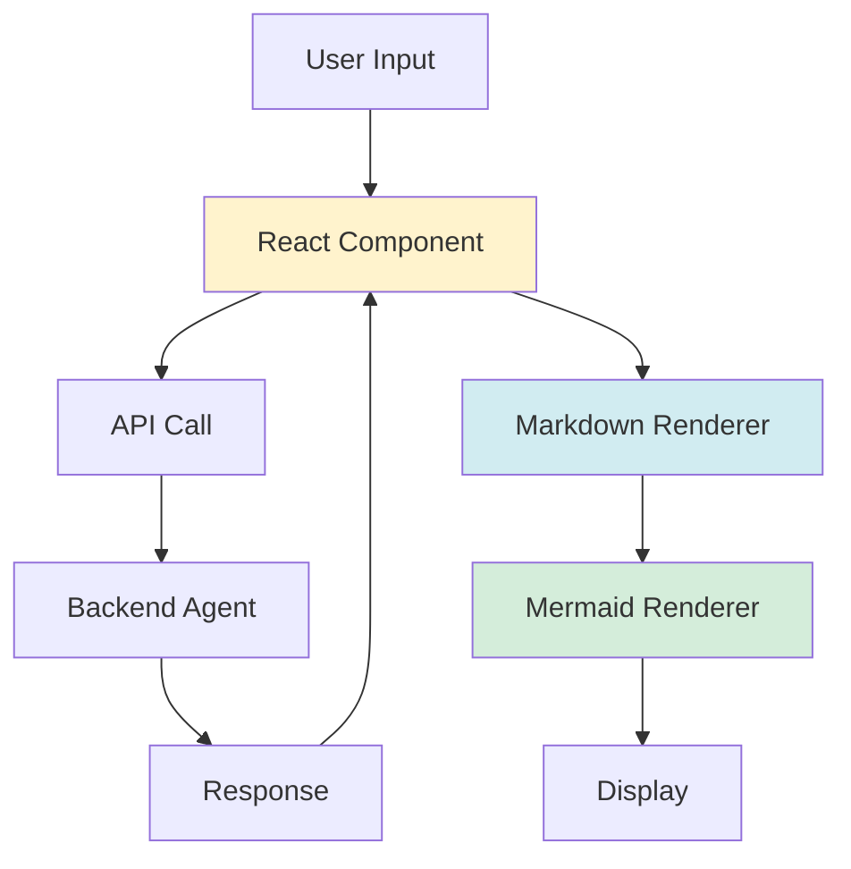

# Chapter 16: Building the Frontend

In this chapter, we'll build a frontend to interact with your AI agent. We'll use React with UMD for simplicity.

## Frontend Architecture



## Basic Setup

### HTML Structure

```html
<!DOCTYPE html>
<html lang="en">
<head>
    <meta charset="UTF-8">
    <title>Bible AI</title>
    <script crossorigin src="https://unpkg.com/react@18/umd/react.production.min.js"></script>
    <script crossorigin src="https://unpkg.com/react-dom@18/umd/react-dom.production.min.js"></script>
    <script src="https://unpkg.com/@babel/standalone/babel.min.js"></script>
    <script src="https://cdn.jsdelivr.net/npm/marked/marked.min.js"></script>
    <script src="https://cdn.jsdelivr.net/npm/mermaid@10/dist/mermaid.min.js"></script>
</head>
<body>
    <div id="root"></div>
    <script type="text/babel">
        // React code here
    </script>
</body>
</html>
```

## React Component

### Basic Component

```javascript
const { useState, useEffect } = React;

function BibleAI() {
    const [messages, setMessages] = useState([]);
    const [input, setInput] = useState('');
    const [loading, setLoading] = useState(false);
    const [sessionId] = useState(() => crypto.randomUUID());
    
    const sendMessage = async () => {
        if (!input.trim()) return;
        
        const userMessage = { role: 'user', content: input };
        setMessages(prev => [...prev, userMessage]);
        setInput('');
        setLoading(true);
        
        try {
            const response = await fetch('/api/bible/query', {
                method: 'POST',
                headers: { 'Content-Type': 'application/json' },
                body: JSON.stringify({ query: input, sessionId })
            });
            
            const data = await response.json();
            const assistantMessage = { role: 'assistant', content: data.response };
            setMessages(prev => [...prev, assistantMessage]);
        } catch (error) {
            console.error('Error:', error);
        } finally {
            setLoading(false);
        }
    };
    
    return (
        <div className="app">
            <div className="messages">
                {messages.map((msg, idx) => (
                    <div key={idx} className={`message ${msg.role}`}>
                        <div dangerouslySetInnerHTML={{ 
                            __html: marked.parse(msg.content) 
                        }} />
                    </div>
                ))}
            </div>
            <div className="input-area">
                <input
                    value={input}
                    onChange={(e) => setInput(e.target.value)}
                    onKeyPress={(e) => e.key === 'Enter' && sendMessage()}
                    placeholder="Ask a question..."
                />
                <button onClick={sendMessage} disabled={loading}>
                    Send
                </button>
            </div>
        </div>
    );
}

ReactDOM.render(<BibleAI />, document.getElementById('root'));
```

## Markdown Rendering

### Using marked.js

```javascript
const renderMarkdown = (text) => {
    const html = marked.parse(text);
    return { __html: html };
};

<div dangerouslySetInnerHTML={renderMarkdown(message.content)} />
```

## Mermaid Diagram Rendering

### Custom Renderer

```javascript
const renderer = new marked.Renderer();
renderer.code = function(code, language) {
    if (language === 'mermaid') {
        return `<div class="mermaid">${code}</div>`;
    }
    return `<pre><code>${code}</code></pre>`;
};

marked.setOptions({ renderer });
```

### Initialize Mermaid

```javascript
useEffect(() => {
    mermaid.initialize({ startOnLoad: false });
    
    // Render all mermaid diagrams
    const mermaidElements = document.querySelectorAll('.mermaid');
    mermaidElements.forEach((element, idx) => {
        if (!element.hasAttribute('data-processed')) {
            mermaid.render(`mermaid-${idx}`, element.textContent, (svg) => {
                element.innerHTML = svg;
                element.setAttribute('data-processed', 'true');
            });
        }
    });
}, [messages]);
```

## Resizable Panes

### Split Pane Implementation

```javascript
const [leftWidth, setLeftWidth] = useState(300);
const [dragging, setDragging] = useState(false);

const handleMouseDown = () => setDragging(true);
const handleMouseMove = (e) => {
    if (dragging) {
        setLeftWidth(e.clientX);
    }
};
const handleMouseUp = () => setDragging(false);

useEffect(() => {
    if (dragging) {
        document.addEventListener('mousemove', handleMouseMove);
        document.addEventListener('mouseup', handleMouseUp);
        return () => {
            document.removeEventListener('mousemove', handleMouseMove);
            document.removeEventListener('mouseup', handleMouseUp);
        };
    }
}, [dragging]);

return (
    <div className="main-container">
        <div className="left-pane" style={{ width: leftWidth }}>
            {/* Conversation */}
        </div>
        <div 
            className="resizer"
            onMouseDown={handleMouseDown}
        />
        <div className="right-pane">
            {/* Preview */}
        </div>
    </div>
);
```

## Best Practices

### ✅ Do

- **Use React hooks** for state management
- **Handle loading states** for better UX
- **Render markdown** for formatted responses
- **Support Mermaid diagrams** for visualizations
- **Handle errors gracefully**
- **Use session IDs** for conversation history

### ❌ Don't

- Ignore loading states
- Skip error handling
- Forget to sanitize HTML
- Skip Mermaid initialization

## Quick Reference

### Basic Frontend Template

```javascript
const { useState } = React;

function App() {
    const [input, setInput] = useState('');
    const [messages, setMessages] = useState([]);
    
    const sendMessage = async () => {
        const response = await fetch('/api/query', {
            method: 'POST',
            headers: { 'Content-Type': 'application/json' },
            body: JSON.stringify({ query: input })
        });
        const data = await response.json();
        setMessages(prev => [...prev, 
            { role: 'user', content: input },
            { role: 'assistant', content: data.response }
        ]);
    };
    
    return (
        <div>
            <div className="messages">
                {messages.map((msg, idx) => (
                    <div key={idx} className={msg.role}>
                        {msg.content}
                    </div>
                ))}
            </div>
            <input value={input} onChange={(e) => setInput(e.target.value)} />
            <button onClick={sendMessage}>Send</button>
        </div>
    );
}
```

## Next Steps

Now that you can build frontends:

1. **Chapter 17**: Error handling
2. **Chapter 20**: Deployment
3. **Chapter 24**: Security

## Key Takeaways

✅ **React UMD** = Simple setup without build tools  
✅ **Markdown rendering** = Formatted responses  
✅ **Mermaid support** = Visual diagrams  
✅ **Session management** = Conversation history  
✅ **Resizable panes** = Better UX  

**Remember:** A good frontend makes your agent accessible!

---

## Navigation

| [← Previous](15-rest-api-design) | [Home](home) | [Next →](17-error-handling) |
|:---|:---:|---:|
| Chapter 15: REST API Design | Building Agentic AI Applications with Java | Chapter 17: Error Handling |

