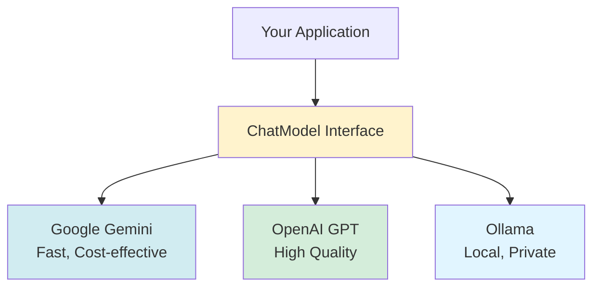
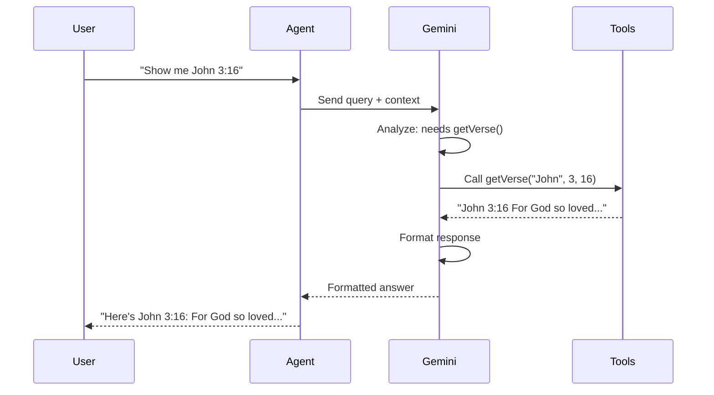
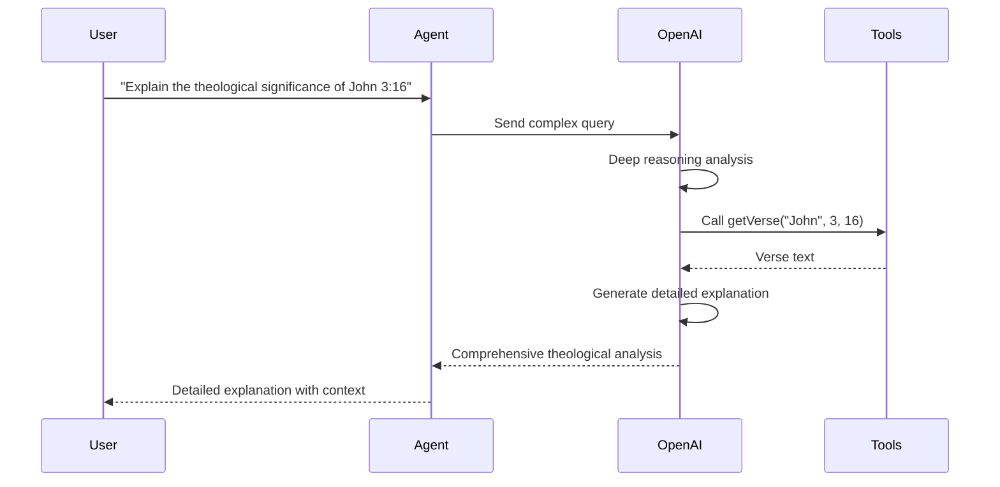
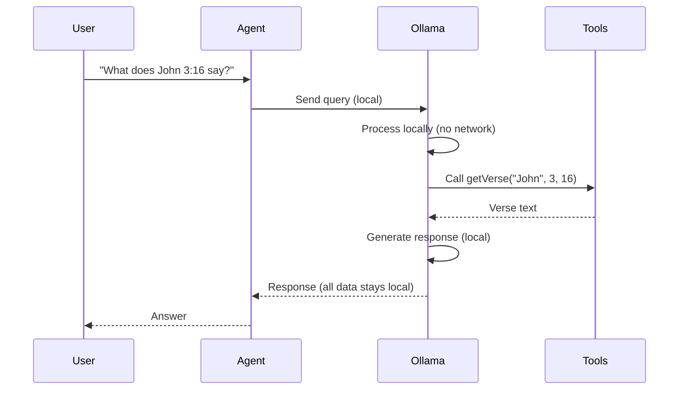

# Chapter 21: Multi-LLM Support

In this chapter, we'll learn how to support multiple LLM providers and when to use each one.

## Why Support Multiple LLMs?

Different LLM providers have different strengths:



**Benefits:**
- **Flexibility**: Switch providers based on needs
- **Cost optimization**: Use cheaper models for simple tasks
- **Reliability**: Fallback if one provider fails
- **Privacy**: Use local models when needed

## Provider Abstraction

### Use ChatModel Interface

The key to multi-LLM support is using the `ChatModel` interface, not specific implementations:

```java
@Service
@RequiredArgsConstructor
public class BibleAgent {
    private final ChatModel chatModel;  // Interface, not GoogleAiGeminiChatModel
    
    public String handleQuery(String query) {
        // Works with any provider!
        BibleAssistant assistant = AiServices.builder(BibleAssistant.class)
            .chatModel(chatModel)  // Any ChatModel implementation
            .tools(bibleTools)
            .build();
        return assistant.chat(query);
    }
}
```

## Google Gemini

### Overview

**Gemini** is Google's LLM family. Great for most applications.

**Strengths:**
- ✅ Fast response times
- ✅ Cost-effective (especially Flash models)
- ✅ Good function calling support
- ✅ Free tier available

**Use Cases:**
- General-purpose applications
- High-volume applications (cost-effective)
- Development and testing
- Applications needing fast responses

### Setup

**Step 1: Add Dependency**

```xml
<dependency>
    <groupId>dev.langchain4j</groupId>
    <artifactId>langchain4j-google-ai-gemini</artifactId>
    <version>1.2.0</version>
</dependency>
```

**Step 2: Configuration**

```java
@Configuration
@Log4j2
public class LLMConfig {
    
    @Value("${langchain4j.llm.gemini.api-key}")
    private String apiKey;
    
    @Value("${langchain4j.llm.gemini.model-name:gemini-2.5-flash-lite}")
    private String modelName;
    
    @Bean
    public ChatModel geminiChatModel() {
        log.info("Configuring Gemini ChatModel with model: {}", modelName);
        return GoogleAiGeminiChatModel.builder()
                .modelName(modelName)
                .apiKey(apiKey)
                .maxRetries(3)
                .temperature(0.7)
                .maxTokens(2048)
                .build();
    }
}
```

**Step 3: application.yml**

```yaml
langchain4j:
  llm:
    gemini:
      model-name: ${GEMINI_MODEL_NAME:gemini-2.5-flash-lite}
      api-key: ${GEMINI_API_KEY:}
```

**Step 4: Environment Variable**

```bash
export GEMINI_API_KEY=your-api-key-here
```

### Available Models

| Model | Speed | Cost | Quality | Use Case |
|-------|-------|------|---------|----------|
| `gemini-2.5-flash-lite` | ⚡⚡⚡ | 💰 | ⭐⭐ | Development, high volume |
| `gemini-2.5-flash` | ⚡⚡ | 💰💰 | ⭐⭐⭐ | Production, balanced |
| `gemini-2.5-pro` | ⚡ | 💰💰💰 | ⭐⭐⭐⭐ | Complex reasoning |

### Example Flow



### Complete Example

```java
@Configuration
public class LLMConfig {
    
    @Bean
    @ConditionalOnProperty(name = "llm.provider", havingValue = "gemini", matchIfMissing = true)
    public ChatModel chatModel(
            @Value("${langchain4j.llm.gemini.api-key}") String apiKey,
            @Value("${langchain4j.llm.gemini.model-name:gemini-2.5-flash-lite}") String modelName) {
        
        return GoogleAiGeminiChatModel.builder()
                .modelName(modelName)
                .apiKey(apiKey)
                .maxRetries(3)
                .temperature(0.7)
                .maxTokens(2048)
                .build();
    }
}
```

## OpenAI GPT

### Overview

**OpenAI GPT** models are known for high quality and reliability.

**Strengths:**
- ✅ Excellent quality
- ✅ Strong reasoning capabilities
- ✅ Good for complex tasks
- ✅ Reliable API

**Use Cases:**
- Complex reasoning tasks
- High-quality responses required
- Applications where quality > cost
- Enterprise applications

### Setup

**Step 1: Add Dependency**

```xml
<dependency>
    <groupId>dev.langchain4j</groupId>
    <artifactId>langchain4j-open-ai</artifactId>
    <version>1.2.0</version>
</dependency>
```

**Step 2: Configuration**

```java
@Bean
@ConditionalOnProperty(name = "llm.provider", havingValue = "openai")
public ChatModel openAiChatModel(
        @Value("${langchain4j.llm.open-ai.api-key}") String apiKey,
        @Value("${langchain4j.llm.open-ai.model-name:gpt-4o-mini}") String modelName) {
    
    return OpenAiChatModel.builder()
            .apiKey(apiKey)
            .modelName(modelName)
            .temperature(0.7)
            .maxTokens(1000)
            .maxRetries(3)
            .build();
}
```

**Step 3: application.yml**

```yaml
langchain4j:
  llm:
    open-ai:
      api-key: ${OPENAI_API_KEY:}
      model-name: ${OPENAI_MODEL_NAME:gpt-4o-mini}
```

**Step 4: Environment Variable**

```bash
export OPENAI_API_KEY=sk-your-key-here
```

### Available Models

| Model | Speed | Cost | Quality | Use Case |
|-------|-------|------|---------|----------|
| `gpt-4o-mini` | ⚡⚡ | 💰💰 | ⭐⭐⭐ | Cost-effective production |
| `gpt-4o` | ⚡ | 💰💰💰 | ⭐⭐⭐⭐ | Best quality |
| `gpt-3.5-turbo` | ⚡⚡⚡ | 💰 | ⭐⭐ | Fast, cheap |

### Example Flow



### Complete Example

```java
@Configuration
public class LLMConfig {
    
    @Bean
    @ConditionalOnProperty(name = "llm.provider", havingValue = "openai")
    public ChatModel chatModel(
            @Value("${langchain4j.llm.open-ai.api-key}") String apiKey,
            @Value("${langchain4j.llm.open-ai.model-name:gpt-4o-mini}") String modelName) {
        
        log.info("Configuring OpenAI ChatModel with model: {}", modelName);
        return OpenAiChatModel.builder()
                .apiKey(apiKey)
                .modelName(modelName)
                .temperature(0.7)
                .maxTokens(2000)
                .maxRetries(3)
                .build();
    }
}
```

## Ollama (Local)

### Overview

**Ollama** runs LLMs locally on your machine. No API keys needed!

**Strengths:**
- ✅ No API costs
- ✅ Complete privacy (data stays local)
- ✅ No rate limits
- ✅ Works offline

**Use Cases:**
- Privacy-sensitive applications
- Development/testing (no API costs)
- Offline applications
- Learning and experimentation

### Setup

**Step 1: Install Ollama**

```bash
# macOS
brew install ollama

# Linux
curl -fsSL https://ollama.com/install.sh | sh
```

**Step 2: Start Ollama and Pull Model**

```bash
# Start Ollama server
ollama serve

# Pull a model (in another terminal)
ollama pull mistral:7b
# or
ollama pull llama2
# or
ollama pull codellama
```

**Step 3: Add Dependency**

```xml
<dependency>
    <groupId>dev.langchain4j</groupId>
    <artifactId>langchain4j-ollama</artifactId>
    <version>1.2.0</version>
</dependency>
```

**Step 4: Configuration**

```java
@Bean
@ConditionalOnProperty(name = "llm.provider", havingValue = "ollama")
public ChatModel ollamaChatModel(
        @Value("${langchain4j.llm.ollama.base-url:http://localhost:11434}") String baseUrl,
        @Value("${langchain4j.llm.ollama.model-name:mistral:7b}") String modelName) {
    
    log.info("Configuring Ollama ChatModel with model: {} at {}", modelName, baseUrl);
    return OllamaChatModel.builder()
            .baseUrl(baseUrl)
            .modelName(modelName)
            .temperature(0.7)
            .maxRetries(3)
            .build();
}
```

**Step 5: application.yml**

```yaml
langchain4j:
  llm:
    ollama:
      base-url: ${OLLAMA_BASE_URL:http://localhost:11434}
      model-name: ${OLLAMA_MODEL_NAME:mistral:7b}
```

### Available Models

| Model | Size | Quality | Use Case |
|-------|------|---------|----------|
| `mistral:7b` | 4.1GB | ⭐⭐⭐ | General purpose |
| `llama2` | 3.8GB | ⭐⭐⭐ | Good balance |
| `codellama` | 3.8GB | ⭐⭐⭐ | Code generation |
| `phi` | 1.6GB | ⭐⭐ | Lightweight |

### Example Flow



### Complete Example

```java
@Configuration
public class LLMConfig {
    
    @Bean
    @ConditionalOnProperty(name = "llm.provider", havingValue = "ollama")
    public ChatModel chatModel(
            @Value("${langchain4j.llm.ollama.base-url:http://localhost:11434}") String baseUrl,
            @Value("${langchain4j.llm.ollama.model-name:mistral:7b}") String modelName) {
        
        log.info("Configuring Ollama ChatModel: {} at {}", modelName, baseUrl);
        return OllamaChatModel.builder()
                .baseUrl(baseUrl)
                .modelName(modelName)
                .temperature(0.7)
                .timeout(java.time.Duration.ofSeconds(120))  // Local models can be slower
                .build();
    }
}
```

## Dynamic Provider Selection

### Complete Multi-Provider Configuration

```java
@Configuration
@Log4j2
public class LLMConfig {
    
    private final Environment environment;
    
    @Bean
    public ChatModel chatModel() {
        String provider = environment.getProperty("llm.provider", "gemini");
        log.info("Initializing ChatModel with provider: {}", provider);
        
        return switch (provider.toLowerCase()) {
            case "openai" -> createOpenAI();
            case "ollama" -> createOllama();
            case "gemini", default -> createGemini();
        };
    }
    
    private ChatModel createGemini() {
        String apiKey = environment.getProperty("langchain4j.llm.gemini.api-key");
        String modelName = environment.getProperty("langchain4j.llm.gemini.model-name", 
                                                   "gemini-2.5-flash-lite");
        
        return GoogleAiGeminiChatModel.builder()
                .modelName(modelName)
                .apiKey(apiKey)
                .maxRetries(3)
                .temperature(0.7)
                .build();
    }
    
    private ChatModel createOpenAI() {
        String apiKey = environment.getProperty("langchain4j.llm.open-ai.api-key");
        String modelName = environment.getProperty("langchain4j.llm.open-ai.model-name", 
                                                  "gpt-4o-mini");
        
        return OpenAiChatModel.builder()
                .apiKey(apiKey)
                .modelName(modelName)
                .temperature(0.7)
                .maxRetries(3)
                .build();
    }
    
    private ChatModel createOllama() {
        String baseUrl = environment.getProperty("langchain4j.llm.ollama.base-url", 
                                                 "http://localhost:11434");
        String modelName = environment.getProperty("langchain4j.llm.ollama.model-name", 
                                                  "mistral:7b");
        
        return OllamaChatModel.builder()
                .baseUrl(baseUrl)
                .modelName(modelName)
                .temperature(0.7)
                .timeout(java.time.Duration.ofSeconds(120))
                .build();
    }
}
```

### application.yml

```yaml
# Select provider: gemini, openai, or ollama
llm:
  provider: ${LLM_PROVIDER:gemini}

langchain4j:
  llm:
    gemini:
      model-name: ${GEMINI_MODEL_NAME:gemini-2.5-flash-lite}
      api-key: ${GEMINI_API_KEY:}
    
    open-ai:
      model-name: ${OPENAI_MODEL_NAME:gpt-4o-mini}
      api-key: ${OPENAI_API_KEY:}
    
    ollama:
      base-url: ${OLLAMA_BASE_URL:http://localhost:11434}
      model-name: ${OLLAMA_MODEL_NAME:mistral:7b}
```

## Use Case Comparison

### When to Use Gemini

✅ **Development & Testing**
- Fast iteration
- Free tier available
- Good for prototyping

✅ **High-Volume Applications**
- Cost-effective
- Fast responses
- Good throughput

✅ **General-Purpose Applications**
- Balanced quality/speed/cost
- Good function calling
- Reliable API

**Example:**
```bash
export LLM_PROVIDER=gemini
export GEMINI_API_KEY=your-key
# Use gemini-2.5-flash-lite for fast, cheap responses
```

### When to Use OpenAI

✅ **Complex Reasoning Tasks**
- Need high-quality responses
- Complex analysis required
- Quality > cost

✅ **Enterprise Applications**
- Reliability important
- Support available
- Production-grade

✅ **Specialized Tasks**
- Code generation (Codex)
- Advanced reasoning (GPT-4)
- High accuracy needed

**Example:**
```bash
export LLM_PROVIDER=openai
export OPENAI_API_KEY=sk-your-key
# Use gpt-4o for best quality, gpt-4o-mini for cost-effective
```

### When to Use Ollama

✅ **Privacy-Sensitive Applications**
- Data must stay local
- No external API calls
- Compliance requirements

✅ **Development Without Costs**
- No API keys needed
- Unlimited testing
- Learning/experimentation

✅ **Offline Applications**
- No internet required
- Air-gapped environments
- Edge deployments

**Example:**
```bash
export LLM_PROVIDER=ollama
# No API key needed!
# Start: ollama serve
# Pull model: ollama pull mistral:7b
```

## Fallback Strategy

### Implement Provider Fallback

```java
@Service
@RequiredArgsConstructor
public class BibleAgent {
    private final ChatModel primaryChatModel;
    private final ChatModel fallbackChatModel;  // Optional
    
    public String handleQuery(String query, String sessionId) {
        try {
            return executeWithModel(primaryChatModel, query, sessionId);
        } catch (Exception e) {
            log.warn("Primary model failed, using fallback", e);
            if (fallbackChatModel != null) {
                return executeWithModel(fallbackChatModel, query, sessionId);
            }
            throw e;
        }
    }
    
    private String executeWithModel(ChatModel model, String query, String sessionId) {
        BibleAssistant assistant = AiServices.builder(BibleAssistant.class)
            .chatModel(model)
            .tools(bibleTools)
            .build();
        return assistant.chat(query);
    }
}
```

## Best Practices

### ✅ Do

- **Use ChatModel interface** - enables provider switching
- **Switch by configuration** - no code changes needed
- **Support fallback** - handle provider failures
- **Log provider selection** - for debugging
- **Test with multiple providers** - ensure compatibility

### ❌ Don't

- Hardcode provider in code
- Use implementation classes directly
- Ignore provider-specific features
- Skip error handling
- Forget to test fallback

## Quick Reference

### Provider Selection

```java
@Bean
public ChatModel chatModel(@Value("${llm.provider}") String provider) {
    return switch (provider) {
        case "openai" -> createOpenAI();
        case "ollama" -> createOllama();
        default -> createGemini();
    };
}
```

### Configuration Template

```yaml
llm:
  provider: ${LLM_PROVIDER:gemini}

langchain4j:
  llm:
    gemini:
      api-key: ${GEMINI_API_KEY:}
    open-ai:
      api-key: ${OPENAI_API_KEY:}
    ollama:
      base-url: ${OLLAMA_BASE_URL:http://localhost:11434}
```

## Next Steps

1. **Chapter 22**: Custom embeddings
2. **Chapter 24**: Security

## Key Takeaways

✅ **Interface abstraction** = Easy provider switching  
✅ **Configuration-driven** = Flexible setup  
✅ **Gemini** = Fast, cost-effective, great for most applications  
✅ **OpenAI** = High quality, best for complex reasoning  
✅ **Ollama** = Local, private, no API costs  
✅ **Use ChatModel interface** = Switch providers without code changes  
✅ **Fallback strategy** = Handle provider failures gracefully  

**Remember:** 
- Choose Gemini for most applications (fast, cost-effective)
- Choose OpenAI for complex reasoning or high-quality requirements
- Choose Ollama for privacy-sensitive or offline applications
- Use configuration to switch providers easily

---

## Navigation

| [← Previous](20-deployment) | [Home](home) | [Next →](22-custom-embeddings) |
|:---|:---:|---:|
| Chapter 20: Deployment | Building Agentic AI Applications with Java | Chapter 22: Custom Embeddings |

