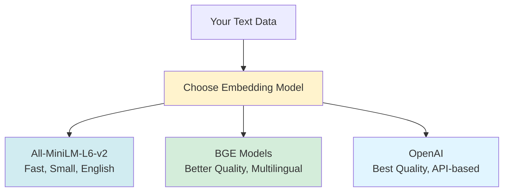
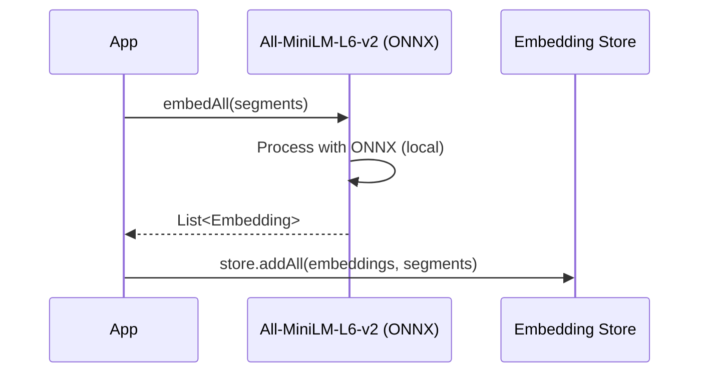
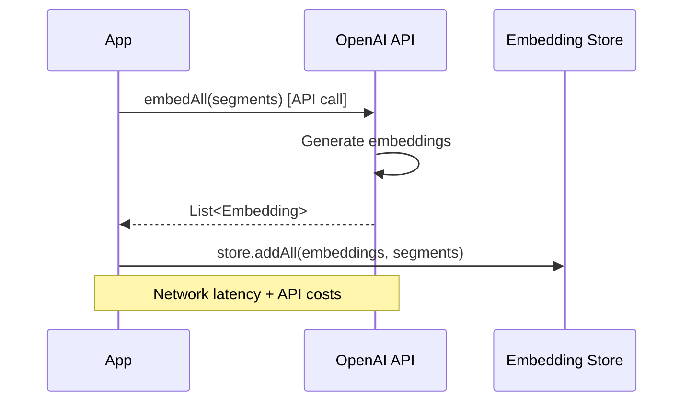
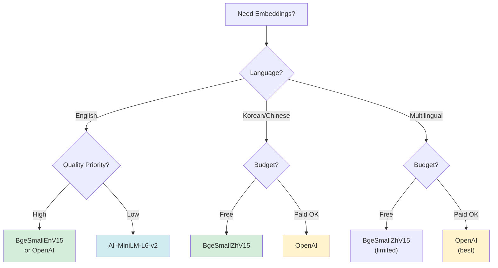

# Chapter 22: Custom Embeddings

In this chapter, we'll explore different embedding models in depth and learn when to use each one.

## Why Choose Different Embedding Models?

Different embedding models have different strengths:



**Factors to Consider:**
- **Language support** - Does it support your language?
- **Quality** - How accurate are the embeddings?
- **Speed** - How fast is embedding generation?
- **Size** - How much memory does it use?
- **Cost** - Free (local) vs. API costs

## Embedding Model Comparison

| Model | Dimensions | Language | Speed | Quality | Cost | Size |
|-------|-----------|----------|-------|---------|------|------|
| All-MiniLM-L6-v2 | 384 | English | ⚡⚡⚡ | ⭐⭐⭐ | Free | 23MB |
| BgeSmallEnV15 | 384 | English | ⚡⚡ | ⭐⭐⭐⭐ | Free | 33MB |
| BgeSmallZhV15 | 384 | Chinese/Korean | ⚡⚡ | ⭐⭐⭐⭐ | Free | 33MB |
| OpenAI text-embedding-3-small | 1536 | Multilingual | ⚡⚡⚡ | ⭐⭐⭐⭐⭐ | Paid | API |
| OpenAI text-embedding-3-large | 3072 | Multilingual | ⚡⚡ | ⭐⭐⭐⭐⭐ | Paid | API |

## All-MiniLM-L6-v2 (Quantized)

### Overview

**All-MiniLM-L6-v2** is a small, fast embedding model optimized for English text. The quantized version runs locally using ONNX.

**Strengths:**
- ✅ Very fast (quantized, ONNX-optimized)
- ✅ Small model size (~23MB)
- ✅ Runs locally (no API needed)
- ✅ Good for English text
- ✅ Low memory usage

**Limitations:**
- ❌ English-focused (poor for other languages)
- ❌ Smaller dimension (384) vs. larger models
- ❌ Less accurate than larger models

### Technical Details

- **Dimensions:** 384
- **Model Size:** ~23MB (quantized)
- **Framework:** ONNX Runtime
- **Quantization:** INT8 (reduced precision for speed)
- **Max Sequence Length:** 256 tokens
- **Training:** Trained on English text

### Setup

**Step 1: Add Dependency**

```xml
<dependency>
    <groupId>dev.langchain4j</groupId>
    <artifactId>langchain4j-embeddings-all-minilm-l6-v2-q</artifactId>
    <version>1.2.0-beta8</version>
</dependency>
```

**Step 2: Configuration**

```java
@Bean
public EmbeddingModel embeddingModel() {
    return new AllMiniLmL6V2QuantizedEmbeddingModel();
}
```

**That's it!** The model downloads automatically on first use.

### Use Cases

✅ **Best for:**
- English text applications
- High-volume embedding generation
- Applications needing fast responses
- Development and testing
- Memory-constrained environments

❌ **Not ideal for:**
- Non-English text (especially Asian languages)
- Applications requiring highest accuracy
- Multilingual applications

### Performance Characteristics

```java
// Embedding generation is fast
List<Embedding> embeddings = embeddingModel.embedAll(segments).content();
// ~1000 segments/second on modern CPU
```

**Benchmarks:**
- **Speed:** ~1ms per segment (CPU)
- **Memory:** ~100MB runtime memory
- **Accuracy:** Good for English, poor for Korean/Chinese

### Example Flow



## BGE (BAAI General Embedding) Models

### Overview

**BGE models** are high-quality embedding models developed by BAAI (Beijing Academy of Artificial Intelligence). They offer better quality than All-MiniLM while still running locally.

### BgeSmallEnV15 (English)

**BgeSmallEnV15** is optimized for English text with better quality than All-MiniLM.

**Strengths:**
- ✅ Better quality than All-MiniLM
- ✅ Still fast (quantized)
- ✅ Runs locally
- ✅ Good for English text

**Limitations:**
- ❌ Larger than All-MiniLM (~33MB)
- ❌ Still English-focused

### Setup

**Step 1: Add Dependency**

```xml
<dependency>
    <groupId>dev.langchain4j</groupId>
    <artifactId>langchain4j-embeddings-bge-small-en-v15-q</artifactId>
    <version>1.2.0-beta8</version>
</dependency>
```

**Step 2: Configuration**

```java
@Bean
public EmbeddingModel embeddingModel() {
    return new BgeSmallEnV15QuantizedEmbeddingModel();
}
```

### Use Cases

✅ **Best for:**
- English text requiring better quality
- When All-MiniLM accuracy isn't sufficient
- Applications where quality > speed

### BgeSmallZhV15 (Chinese/Korean)

**BgeSmallZhV15** is optimized for Chinese and Korean text, making it better for multilingual applications.

**Strengths:**
- ✅ Good for Chinese and Korean text
- ✅ Better than All-MiniLM for Asian languages
- ✅ Runs locally
- ✅ Quantized (fast)

**Limitations:**
- ❌ Still not perfect for Korean (better than All-MiniLM though)
- ❌ Larger model size

### Setup

**Step 1: Add Dependency**

```xml
<dependency>
    <groupId>dev.langchain4j</groupId>
    <artifactId>langchain4j-embeddings-bge-small-zh-v15-q</artifactId>
    <version>1.2.0-beta8</version>
</dependency>
```

**Step 2: Configuration**

```java
@Bean
public EmbeddingModel embeddingModel() {
    return new BgeSmallZhV15QuantizedEmbeddingModel();
}
```

### Use Cases

✅ **Best for:**
- Chinese text applications
- Korean text (better than All-MiniLM)
- Multilingual applications with Asian languages
- When you need better non-English support

### Performance Comparison: BGE vs. All-MiniLM

| Aspect | All-MiniLM-L6-v2 | BgeSmallEnV15 | BgeSmallZhV15 |
|--------|------------------|---------------|---------------|
| **English Quality** | ⭐⭐⭐ | ⭐⭐⭐⭐ | ⭐⭐⭐ |
| **Korean Quality** | ⭐ | ⭐ | ⭐⭐ |
| **Chinese Quality** | ⭐ | ⭐ | ⭐⭐⭐⭐ |
| **Speed** | ⚡⚡⚡ | ⚡⚡ | ⚡⚡ |
| **Size** | 23MB | 33MB | 33MB |

## OpenAI Embeddings

### Overview

**OpenAI Embeddings** are high-quality, API-based embedding models. They offer the best quality but require API calls and incur costs.

**Strengths:**
- ✅ Best quality embeddings
- ✅ Excellent multilingual support
- ✅ Large dimensions (more information)
- ✅ Reliable API

**Limitations:**
- ❌ Requires API key
- ❌ Costs money (per token)
- ❌ Network latency
- ❌ Rate limits

### Available Models

#### text-embedding-3-small

- **Dimensions:** 1536
- **Cost:** $0.02 per 1M tokens
- **Speed:** Fast
- **Quality:** ⭐⭐⭐⭐⭐

#### text-embedding-3-large

- **Dimensions:** 3072
- **Cost:** $0.13 per 1M tokens
- **Speed:** Slower
- **Quality:** ⭐⭐⭐⭐⭐ (best)

### Setup

**Step 1: Add Dependency**

```xml
<dependency>
    <groupId>dev.langchain4j</groupId>
    <artifactId>langchain4j-open-ai</artifactId>
    <version>1.2.0</version>
</dependency>
```

**Step 2: Configuration**

```java
@Bean
public EmbeddingModel embeddingModel(
        @Value("${langchain4j.embeddings.open-ai.api-key}") String apiKey) {
    return new OpenAiEmbeddingModel(
        apiKey,
        "text-embedding-3-small"  // or "text-embedding-3-large"
    );
}
```

**Step 3: application.yml**

```yaml
langchain4j:
  embeddings:
    open-ai:
      api-key: ${OPENAI_API_KEY:}
      model-name: ${OPENAI_EMBEDDING_MODEL:text-embedding-3-small}
```

**Step 4: Environment Variable**

```bash
export OPENAI_API_KEY=sk-your-key-here
```

### Use Cases

✅ **Best for:**
- Applications requiring highest quality
- Multilingual applications
- Production applications where quality is critical
- When cost is acceptable

❌ **Not ideal for:**
- High-volume, low-cost applications
- Offline applications
- Privacy-sensitive applications (data sent to API)

### Cost Considerations

**Example Cost Calculation:**

For 100,000 text segments (average 50 tokens each = 5M tokens):

- **text-embedding-3-small:** $0.10 (5M × $0.02/1M)
- **text-embedding-3-large:** $0.65 (5M × $0.13/1M)

**vs. Local Models:**
- **All-MiniLM/BGE:** $0 (one-time download)

### Example Flow



## Model Selection Guide

### Decision Tree



### Selection Matrix

| Use Case | Recommended Model | Why |
|----------|------------------|-----|
| **English, High Volume** | All-MiniLM-L6-v2 | Fast, free, good enough |
| **English, High Quality** | BgeSmallEnV15 | Better quality, still free |
| **Korean/Chinese** | BgeSmallZhV15 | Best free option for Asian languages |
| **Multilingual, Quality Critical** | OpenAI text-embedding-3-large | Best quality, supports all languages |
| **Multilingual, Cost-Conscious** | OpenAI text-embedding-3-small | Good quality, lower cost |
| **Privacy-Sensitive** | Any local model | Data stays on your machine |
| **Offline** | Any local model | No API calls needed |

## Dynamic Model Selection

### Configuration-Based Selection

```java
@Configuration
@Log4j2
public class EmbeddingConfig {
    
    @Value("${embedding.model:all-minilm}")
    private String modelType;
    
    @Bean
    public EmbeddingModel embeddingModel(
            @Value("${langchain4j.embeddings.open-ai.api-key:}") String openAiApiKey) {
        
        return switch (modelType.toLowerCase()) {
            case "bge-en" -> new BgeSmallEnV15QuantizedEmbeddingModel();
            case "bge-zh" -> new BgeSmallZhV15QuantizedEmbeddingModel();
            case "openai-small" -> new OpenAiEmbeddingModel(openAiApiKey, "text-embedding-3-small");
            case "openai-large" -> new OpenAiEmbeddingModel(openAiApiKey, "text-embedding-3-large");
            case "all-minilm", default -> new AllMiniLmL6V2QuantizedEmbeddingModel();
        };
    }
}
```

### application.yml

```yaml
# Select embedding model
embedding:
  model: ${EMBEDDING_MODEL:all-minilm}  # all-minilm, bge-en, bge-zh, openai-small, openai-large

langchain4j:
  embeddings:
    open-ai:
      api-key: ${OPENAI_API_KEY:}
```

## Testing Different Models

### Compare Model Performance

```java
@SpringBootTest
class EmbeddingModelComparisonTest {
    
    @Test
    void compareModels() {
        EmbeddingModel model1 = new AllMiniLmL6V2QuantizedEmbeddingModel();
        EmbeddingModel model2 = new BgeSmallEnV15QuantizedEmbeddingModel();
        
        String text1 = "God loves the world";
        String text2 = "The Lord cares for people";
        String text3 = "The weather is nice today";  // Unrelated
        
        // Test with model1
        Embedding emb1_1 = model1.embed(text1).content();
        Embedding emb1_2 = model1.embed(text2).content();
        Embedding emb1_3 = model1.embed(text3).content();
        
        double similarity1_2 = cosineSimilarity(emb1_1, emb1_2);  // Should be high
        double similarity1_3 = cosineSimilarity(emb1_1, emb1_3);  // Should be low
        
        // Test with model2
        Embedding emb2_1 = model2.embed(text1).content();
        Embedding emb2_2 = model2.embed(text2).content();
        Embedding emb2_3 = model2.embed(text3).content();
        
        double similarity2_2 = cosineSimilarity(emb2_1, emb2_2);
        double similarity2_3 = cosineSimilarity(emb2_1, emb2_3);
        
        // Compare results
        System.out.println("All-MiniLM: similar=" + similarity1_2 + ", different=" + similarity1_3);
        System.out.println("BGE: similar=" + similarity2_2 + ", different=" + similarity2_3);
        
        // BGE should have better discrimination (higher similar, lower different)
    }
    
    private double cosineSimilarity(Embedding a, Embedding b) {
        // Calculate cosine similarity
        // Implementation omitted for brevity
        return 0.0;
    }
}
```

## Best Practices

### ✅ Do

- **Test models** with your actual data
- **Compare quality** before choosing
- **Consider language** support requirements
- **Factor in costs** (API vs. local)
- **Measure performance** (speed, accuracy)
- **Use quantized models** for local deployment

### ❌ Don't

- Assume one model fits all
- Ignore language requirements
- Skip performance testing
- Forget about costs (API models)
- Use English models for other languages without testing

## Quick Reference

### Model Selection

```java
// English, fast, free
new AllMiniLmL6V2QuantizedEmbeddingModel();

// English, better quality, free
new BgeSmallEnV15QuantizedEmbeddingModel();

// Korean/Chinese, free
new BgeSmallZhV15QuantizedEmbeddingModel();

// Best quality, API-based, paid
new OpenAiEmbeddingModel(apiKey, "text-embedding-3-small");
```

### Configuration Template

```yaml
embedding:
  model: ${EMBEDDING_MODEL:all-minilm}

langchain4j:
  embeddings:
    open-ai:
      api-key: ${OPENAI_API_KEY:}
```

## Next Steps

1. **Chapter 23**: Advanced RAG patterns
2. **Chapter 24**: Security

## Key Takeaways

✅ **All-MiniLM-L6-v2** = Fast, small, good for English (recommended starting point)  
✅ **BgeSmallEnV15** = Better English quality, still free and local  
✅ **BgeSmallZhV15** = Good for Chinese/Korean, better than All-MiniLM for Asian languages  
✅ **OpenAI Embeddings** = Best quality, multilingual, but requires API and costs money  
✅ **Test models** = Compare with your actual data before choosing  
✅ **Consider language** = Choose model that supports your language  
✅ **Factor in costs** = Local models are free, API models cost per token  
✅ **Quantized models** = Faster and smaller, recommended for local deployment  

**Remember:** 
- Start with All-MiniLM-L6-v2 for English applications
- Use BGE models for better quality or Asian language support
- Use OpenAI for best quality when cost is acceptable
- Always test with your actual data to verify improvements

---

## Navigation

| [← Previous](21-multi-llm-support) | [Home](home) | [Next →](23-advanced-rag-patterns) |
|:---|:---:|---:|
| Chapter 21: Multi-LLM Support | Building Agentic AI Applications with Java | Chapter 23: Advanced RAG Patterns |

